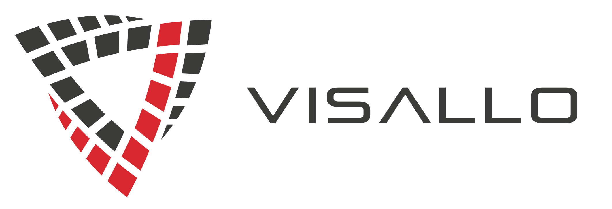

As the volume of data we collect has continued to grow, so too has the challenge of figuring out how best to leverage it. The problem has shifted from not having enough data to having too much, which is putting a strain on analysts and investigators who need to make sense of everything. That's why we built Visallo.

## How is Visallo different?

Visallo is an **investigative case management platform** built to help **people** solve **ambiguous problems**. The foundational motivations behind Visallo are

* **Designed and Built as a Platform** - Products don't always solve your exact problems out of the box. Visallo is built as a data analysis platform underpinning a suite of analytic and visualization plugins exposed through a clean, fast, web-based interface. Many plugins are available out of the box, but the real value is derived from the extensibility and customizability of the platform. It can truly be tailored to solve **your** problems.
* **Built for People** - We recognize that the best analysis continues to be done by people. People are still better than computers at making analytical judgements in ambiguous situations, but can't handle the massive amounts of data being accumulated. That's where Visallo comes in, helping people leverage huge quantities of data to analyze and solve problems.
* **Tailored for Ambiguous Problems** - Visallo is best-suited for helping people solve problems where there's no straightforward solution. For many problems, there is no "correct" answer and you may not even know what you're looking for when you start. Visallo will help you organize and understand your data and the hidden connections embedded within it.
* **Released as Open Source** - The core of Visallo is freely available as open source software. We released Visallo as Open Source Software (OSS) to relieve customers of any fears of proprietary vendor lock-in, to provide insight into the code base, and to facilitate the development of new plugins to quickly bring enhanced functionality to the platform.
