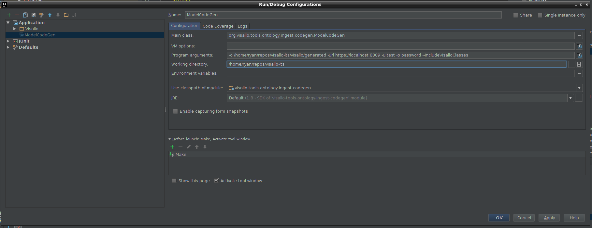

# Ingest 

Visallo has a module that allows you to generate code that will interact with your repository to generate code for you to custom import code. By using the generated code, you can use any software that runs on the JVM to import Visallo data. 

## Using the code generator

It is typical to use the code generator inside of your IDE while developing in the Visallo project. The class `org.visallo.tools.ontology.ingest.codegen.ModelCodeGen` exposes a main method that you can use to interact with the ontology. There are two ways to use it:

* Connect to a running Visallo instance and get the ontology from there
* Have an ontology in json format and use it to run the code generator

Run the `org.visallo.tools.ontology.ingest.codegen.ModelCodeGen` class with no arguments in order to see what command line parameters there are. For both, you will need to specify an output directory using the command line argument -o *<outputDirectory>* but, depending on which steps you take to get the ontology, you may require more parameters.

### Connect to the Webserver

To connect to the webserver you will also need to have the command line parameters 

* -url *visallo url*
* -u *username*
* -p *password*

and you will possibly need *--includeVisalloClasses* if your ontology has a url that starts with http://visallo.org since those are filtered out by default. If your ontology does not and you do not need to interact with Visallos built in ontology, you can skip that command line parameter.

For example, in intellij, your run configuration may look something like the following and will automatically generate the ontology java code in the directory that you specify:

 

Once run, the code will then be generated into the directory that you have specified.

### Have an ontology json file

While it is possible for you to specify a file that can be used in place of calling Visallo in order to get the ontology, there is no current native way to do it. You will have to have saved the result from the REST call once before into a file so that you can keep using that. The benefit of this approach is that you can develop with the ontology offline from having the app running, but it won't necessarily be updated if there is an ontology change inside of Visallo. Therefore, while possible this way is not recommended and you should query a running instance of the app every time.

## Working with the generated code

Once you have generated the code, you can start using it in order to start ingesting your data. For example, using the sample ontology we can write the following code snippet in order to ingest an email entity into the system.

