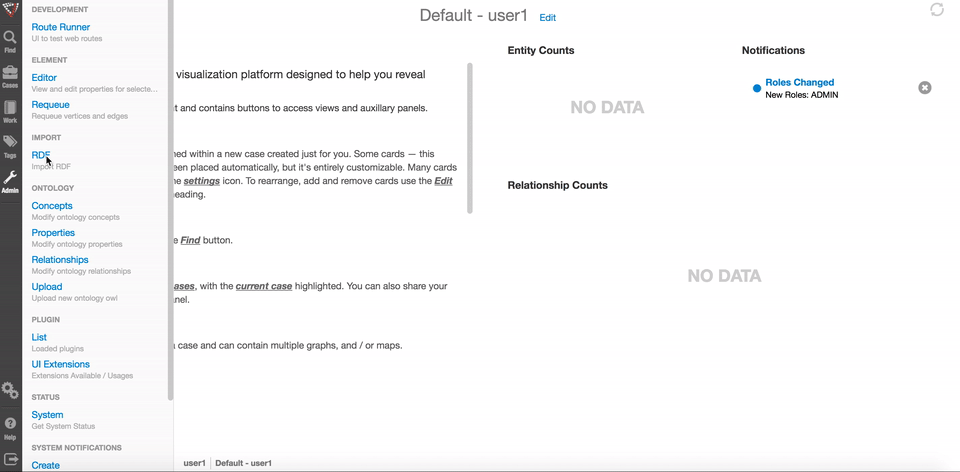

# RDF Import

For simple ingestion processes, it is possible to use an RDF file with both xml and n-triple files. 

## RDF Files

### NT Format

NT files that can be imported into Visallo are 

Each line in an NT file represents a single item of data that can be imported into Visallo. An NT file will have the following format:


```xml
  # create an email
  <http://visallo.com/email1> <http://visallo.org#conceptType> "http://visallo.org/sample#emailAddress"
  <http://visallo.com/email1> <http://visallo.org#title> "ryan@v5analytics.com"
  
  # create another email
  <http://visallo.com/email2> <http://visallo.org#conceptType> "http://visallo.org/sample#emailAddress"
  <http://visallo.com/email2> <http://visallo.org#title> "susan@v5analytics.com"
  
  # create an edge
  <http://visallo.com/email1> <http://visallo.org/structured-file#elementHasSource> <http://visallo.com/email2>
```

In this file, two email entities are created and an edge is created between them. 


#### Vertex

A vertex is made implicity by creating a property on it. In Visallo, the minimal vertex that can be used inside of the application smoothly is one with a concept type. To create a vertex it is preferable to create one as the following by specifying both the id of the future vertex and the concept type of the vertex. In the following example, we are assuming that you are using the [sample ontology](https://github.com/v5analytics/visallo/config/ontology/sample.owl) with Visallo.

```xml
<email1> <http://visallo.org#conceptType> "http://visallo.org/sample#emailAddress"
```

If you were to create multiple vertices with multiple concept types the NT file would look like:

```xml
  # create two vertices with the concept type of email address
<email1> <http://visallo.org#conceptType> "http://visallo.org/sample#emailAddress"
<email2> <http://visallo.org#conceptType> "http://visallo.org/sample#emailAddress"

  # create three vertices with the concept type of phone number
<phonenumber1> <http://visallo.org#conceptType> "http://visallo.org/sample#phoneNumber"
<phonenumber2> <http://visallo.org#conceptType> "http://visallo.org/sample#phoneNumber"
<phonenumber3> <http://visallo.org#conceptType> "http://visallo.org/sample#phoneNumber"

  # create one vertex with a concept type of contact info
<contactinfo1> <http://visallo.org#conceptType> "http://visallo.org/sample#contactInfo"
```

#### Vertex Properties

Creating a vertex property is very similar to the above examples of creating a vertex because when you are setting the concept type property on a vertex, you are in fact setting a property on a vertex which implicitly creates the vertex. In order to create a property on a vertex follow the same format as above, but substitute the correct property inside of the second set of brackets to set the property. Lets consider a possible ontology for a person that has been added to the sample ontology and has 4 different properties:

<table>
<thead>
<tr><th>Property</th><th>Ontology IRI</th></tr>
</thead>
<tbody>
<tr><td>name</td><td>http://visallo.com/sample#name</td></tr>
<tr><td>address</td><td>http://visallo.com/sample#address</td></tr>
<tr><td>is employed</td><td>http://visallo.com/sample#isemployed</td></tr>
<tr><td>height (in inches)</td><td>http://visallo.com/sample#height</td></tr>
</tbody>
</table>

If we load an element with complete data through the RDF Importer file, it will look like the following:

```xml
# create the vertex
<person1> <http://visallo.org#conceptType> "http://visallo.org/sample#person"
<person1> <http://visallo.org#sample> "http://visallo.org/sample#person"
```

##### Property Types

You probably noticed that we add data types onto the properties when we are ingesting the properties. Although the datatypes are not enforced by the RDF Importer, there can be unexpected behavior inside of Visallo when data is ingested as a different datatype than the one that is specified in the ontology. 

To specify the data type for the data that you are ingesting, you must create the data property as follows:

<table><thead>
<tr><th>Type</th><th>Data Type</th><th>Description</th><th>Example</th></tr>
</thead>
<tbody>
<tr><td>Geolocation</td><td>http://visallo.org#geolocation</td><td></td><td></td></tr>
<tr>
  <td>Streaming Property Value</td>
  <td>http://visallo.org#streamingPropertyValue</td>
  <td></td>
  <td></td>
</tr>
<tr>
<td>Streaming Property Value Inline</td>
<td>http://visallo.org#streamingPropertyValueInline</td>
<td></td>
<td></td></tr>
<tr>
<td>Date</td>
<td>http://www.w3.org/2001/XMLSchema#date</td>
<td></td>
<td></td></tr>
<tr>
<td>DateTime</td>
<td>http://www.w3.org/2001/XMLSchema#dateTime</td>
<td></td>
<td></td></tr>
<tr>
<td>gYear</td>
<td>http://www.w3.org/2001/XMLSchema#gYear</td>
<td></td>
<td></td></tr>
<tr>
<td>gMonthDay</td>
<td>http://www.w3.org/2001/XMLSchema#gMonthDay</td>
<td></td>
<td></td></tr>
<tr>
<td>String</td>
<td>http://www.w3.org/2001/XMLSchema#string</td>
<td></td>
<td></td></tr>
<tr>
<td>Boolean</td>
<td>http://www.w3.org/2001/XMLSchema#boolean</td>
<td></td>
<td></td></tr>
<tr>
<td>Double</td>
<td>http://www.w3.org/2001/XMLSchema#double</td>
<td></td>
<td></td></tr>
<tr>
<td>Currency</td>
<td>http://visallo.org#currency</td>
<td></td>
<td></td></tr>
<tr>
<td>Integer</td>
<td>http://www.w3.org/2001/XMLSchema#int</td>
<td></td>
<td></td></tr>
<tr>
<td>Integer</td>
<td>http://www.w3.org/2001/XMLSchema#integer</td>
<td></td>
<td></td></tr>
</tbody>
</table>

#### Edge

Creating edges in the system will have the following syntax: 

```xml
<*fromVertexId*> <*edgeLabel*:*edgeId*> <*toVertexId*>
```

It is not required to specify an edge id when creating a relationship between two edges but there are situations that make it worthwhile to specify one:

* Your use case requires deterministic edge ids
* You will, at any point in the future, add edge properties to the edge

For a more complete example of creating an edge, lets create two vertices, add title properties to them, and attach them together with an edge:

```xml
# create an email
<email1> <http://visallo.org#conceptType> "http://visallo.org/sample#emailAddress"
# create a property on email1
<email1> <http://visallo.org#title> "ryan@v5analytics.com"

# create another email
<email2> <http://visallo.org#conceptType> "http://visallo.org/sample#emailAddress"
# add a property to email2
<email2> <http://visallo.org#title> "susan@v5analytics.com"

# create an edge
<email1> <http://visallo.org/structured-file#elementHasSource:email1hassourceemail2> <email2>
```

#### Edge Properties

Adding a property to an edge has the following syntax:

```xml
<EDGE:*edgeId*> <*edgePropertyIri*> "*propertyValue*"^^<*propertyDataType>
```

To add a property to the edge that was created above when we created an edge:

```xml
<EDGE:email1hassourceemail2> <http://visallo.com/sample#date> "2015-05-12"^^<http://www.w3.org/2001/XMLSchema#date>
```

The property data types are the same as show above for the Vertex Properties


### RDF XML Import

It is possible to import data into Visallo using a RDF in an XML Format. Following is an example file that will import a single contact information entity from the sample.owl.

```xml
<?xml version="1.0"?>

<!DOCTYPE rdf:RDF [
        <!ENTITY owl "http://www.w3.org/2002/07/owl#" >
        <!ENTITY xsd "http://www.w3.org/2001/XMLSchema#" >
        <!ENTITY rdfs "http://www.w3.org/2000/01/rdf-schema#" >
        <!ENTITY rdf "http://www.w3.org/1999/02/22-rdf-syntax-ns#" >
        <!ENTITY visallo "http://visallo.org/sample#">
        ]>
<rdf:RDF xmlns:rdf="http://www.w3.org/1999/02/22-rdf-syntax-ns#"
         xmlns:visallo="http://visallo.org#">

  <rdf:Description rdf:about="&visallo;contactinfo1">
    <rdf:type rdf:resource="&visallo;contactInformation"/>
    <visallo:title>Test contact information</visallo:title>
  </rdf:Description>

</rdf:RDF>
```

It should be notes that even though it is possible to import some data through the XML API, it is not fully featured at this point and cannot handle adding edges, edge properties, or entity visibilities.

#### Vertex

Importing a single vertex required the following format (The surrounding tags are omitted for brevity):

```xml
<rdf:Description rdf:about="&visallo;*Entity Id*">
  <rdf:type rdf:resource="*concept type*"/>
</rdf:Description>
```

For example, if the namespaces in the xml are set up appropriately, you can add a vertex with the vertex id of "contactinfo1" and the concept type of "http://visallo.org/sample#contactInformation":

```xml
<rdf:description rdf:about="&visallo;contactinfo1">
  <rdf:type rdf:resource="&visallo;contactinformation"/>
</rdf:description>
```

This will add the vertex into Visallo. To add multiple vertices in Visallo, it will look like the following:

```xml
<rdf:description rdf:about="&visallo;contactinfo1">
  <rdf:type rdf:resource="&visallo;contactinformation"/>
</rdf:description>

<rdf:description rdf:about="&visallo;contactinfo2">
  <rdf:type rdf:resource="&visallo;contactinformation"/>
</rdf:description>

<rdf:description rdf:about="&visallo;phoneNumber2">
  <rdf:type rdf:resource="&visallo;phoneNumber"/>
</rdf:description>
```

#### Vertex Properties

To add properties to a vertex, simply add the following line to the vertex declaration:

```xml
<rdf:description rdf:about="&visallo;contactinfo1">
  <rdf:type rdf:resource="&visallo;contactinformation"/>
  <visallo:title>Test Contact Information Vertex</visallo:title>
</rdf:description>
```

These will match up to the DataType Iris inside of your ontology.

## How to import RDF files
 
### External process
 
#### org.visallo.tools.RdfImport 

In Visallo the class that will allow you to import the data from the back end is `org.visallo.tool.RdfImport`. To get a full list of command line argument parameters, run that class in the main method. As an example, if you have your environment correctly configured with java, and you want to import all of the `.nt` files in a directory, you can run the following command: 

`java -cp ${CLASSPATH} org.visallo.tools.RdfImport --indir ./datadir/ --pattern *.{nt}`

This external process is very useful for ingesting data that is too large or split among too many files to be worthwhile ingesting from the front-end.


### Through the webapp UI

Visallo's admin panel has a section on RDF import. Simply upload the file and it will automatically be imported into the public dataset of your Visallo instance. 



This process is useful for adding incremental data by an administrator.
