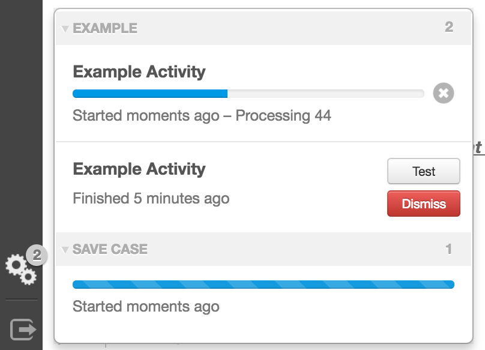

# Activity

* [Activity JavaScript API `org.visallo.activity`](../../../javascript/org.visallo.activity.html)
* [Activity Example Code](https://github.com/visallo/doc-examples/tree/master/extension-activity)

Activity extension points allow plugins to add additional items to the activity panel (opened via the gears menubar icon.) These rows can show the progress of a long-running process or a front-end task using start/stop events.

## Tutorial

This tutorial will create an example long-running process, and an activity item that shows its progress, along with a custom finished component. For details on creating the back-end long-running process, see the tutorial code link above.

### Create a web plugin

The web plugin registers the resources needed, and creates a route to start the process.



The `POST` route to start the activity includes some filters before the `StartExample` handler. These are run in order and protect the route based on request and session conditions:

* `authenticator`: Will only allow authenticated users
* `csrfProtector`: Prevent cross-site request forgery attacks. Should be placed on all requests
* `ReadPrivilegeFilter`: Will only allow users that have this privilege. [Other filters](https://github.com/visallo/visallo/tree/master/web/web-base/src/main/java/org/visallo/web/privilegeFilters) available in Visallo

### Register Extension

Register the activity extension in the `plugin.js` file. The type provided should match the type of the custom `QueueItem`.



### Internationalization

Add a message bundle key for the type of activity



### Finished Interface

Define the component to render when the process is complete, this just calls `alert` with the process json. The button will look at home with the dismiss button if it has `btn btn-mini` class names.



