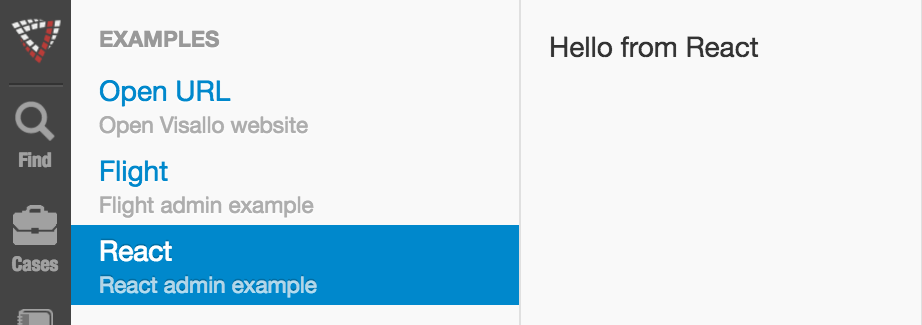

# Admin

* [Admin JavaScript API `org.visallo.admin`](../../../javascript/org.visallo.admin.html)
* [Admin Example Code](https://github.com/visallo/doc-examples/tree/master/extension-admin)

Admin extensions allow sections to be placed in the admin pane that when clicked, open a custom component.

## Tutorial

This tutorial registers three admin extensions that show React, Flight, and an admin extension that opens a link.

### Create a web plugin

First, create the web plugin that registers the resources.



### Register Extension

Register the admin extensions in the `plugin.js` file.



The other two are very similar except we had `sortHint` to "Open URL" so it is first.



Notice we use the globally available [`i18n`](../../../javascript/global.html#i18n) function to display strings. These are defined in `messages.properties`.



