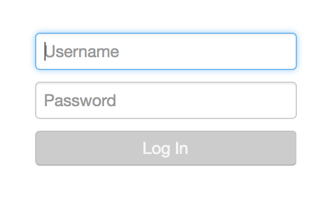

# Authentication

* [Authentication JavaScript API `org.visallo.authentication`](../../../javascript/org.visallo.authentication.html)
* [Authentication Example Code](https://github.com/visallo/doc-examples/tree/master/extension-authentication)

Provide custom authentication interface to login users.

## Tutorial

### Create a web plugin

The web plugin registers the resources needed, and creates a route the form will `POST` credentials.



This extension deviates from others in that the authentication `plugin.js` is registered using `registerBeforeAuthenticationJavaScript`. Since all plugin JavaScript isn't loaded until after login, we need a different way to add scripts to the page earlier. Only the plugin file that registers the extension needs to be registered in this way. The actual authentication component is registered using `registerJavaScript` with the second parameter, `includeInPage` set to false, resulting in the component not being loaded on page load, but is always available to RequireJS.

### Register Extension

Register the authentication extension in the `plugin.js` file.



### Create Component

Create the FlightJS authentication component.



When the login request succeeds, the component triggers `loginSuccess`, this notifies Visallo that the application loading process should attempt to continue loading. If the session is not valid, the front-end state is undefined.



### Login Route

The login route uses Visallo's `UserRepository` to create users, then prepares the session using `CurrentUser.set`.



## More Examples

Visallo includes some default authentication plugins, including username and password, with forgotten password support.

[Example Authentication Component](https://github.com/visallo/visallo/blob/master/web/plugins/auth-username-password/src/main/resources/org/visallo/web/auth/usernamepassword/authentication.js)

[Example Login Route](https://github.com/visallo/visallo/blob/master/web/plugins/auth-username-password/src/main/java/org/visallo/web/auth/usernamepassword/routes/Login.java)

