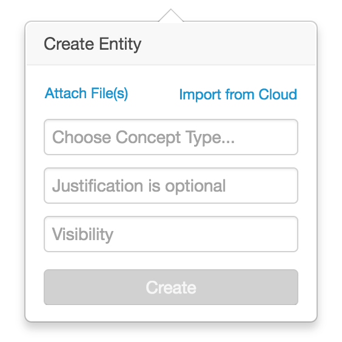
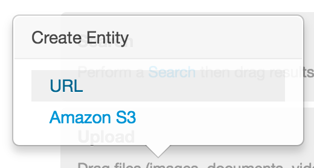
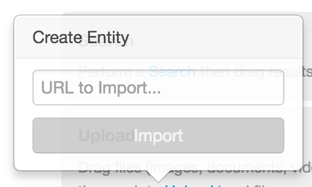

# Ingest from Cloud

* [Ingest Cloud JavaScript API `org.visallo.ingest.cloud`](../../../javascript/org.visallo.ingest.cloud.html)
* [Ingest Cloud Example Code](https://github.com/visallo/doc-examples/tree/master/extension-ingest-cloud)

<div style="text-align:center">

</div>

Create custom endpoints to ingest content into Visallo. A long-running process will process the loading of content asynchronously. Plugins must register a [`CloudResourceSource`](https://github.com/visallo/visallo/blob/master/core/core/src/main/java/org/visallo/core/ingest/cloud/CloudResourceSource.java) service that returns a `CloudResourceItem` (or multiple) given a JSON configuration object generated by a custom component in the UI.

Cloud import items are available in the file import popover.

## Tutorial

For this tutorial we'll build a new URL cloud ingest plugin. The user will supply a URL (to a document, image, etc.) to import into Visallo.

<div style="text-align:center">



</div>

### Web Plugin Resources

Register the plugin and configuration component, along with a message bundle.



### Register Extension




### React Configuration Component

Now, create the React component interface to specify a URL to ingest.



Call the `onImport` when the user clicks import.




### Create the `CloudResourceSource`

Create the Java class, and register as a service in `META-INF/services`. The full Java class should match the `identifier` defined in the extension.






### Message Bundle

The interface needs some message keys for the component, and an implicit `title` based on the `identifier`.




## Flight Component Example

Legacy plugins written in Flight should trigger a `cloudImported` event with the configuration.

For example:

```js
this.trigger('cloudImported', { paths: [url] })
```
