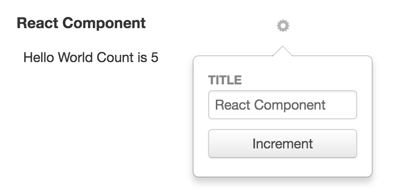

# Dashboard Item

* [Dashboard Item JavaScript API `org.visallo.dashboard.item`](../../../javascript/org.visallo.dashboard.item.html)
* [Dashboard Item Example Code](https://github.com/visallo/doc-examples/tree/master/extension-dashboard-item)

Dashboard items are user-selectable content placed on the dashboard. These could be charts using the `report` configuration or custom components in React or FlightJS.

<div style="text-align:center">


</div>

## Tutorial

In this tutorial we will create two new dashboard items:

* Component that defines a report to show concept type counts 
* Custom React component that renders a number and configuration to increment

### Web Plugin

Register the resources.



### Register Extension

Register two extensions, a report-style card, and a custom component.



#### Report Configuration

The report configuration uses [Visallo element search](../../../javascript/org.visallo.dashboard.item.html#~reportParametersForSearch)



### Create the Custom Component

The custom component will also register a configuration component. It will access a `count` <span class="no-glossary">property</span> in the configuration and display the current value.



In the configuration component, we increment the count (creating if needed) when the button is clicked.



### Wiring Refresh

Dashboard triggers `refreshData` on all items when the user clicks the refresh button in the top-right corner. To wire this message in a React component we need the DOM Element of the item, so first register a `ref` in `render()`



Then, listen for the event, we must use Jquery to listen as Flight uses non-standard event triggering.



Finally, unregister the listener on teardown



## Custom Configuration Interface Elements


Provide a `configurationPath` to the extension to add an additional user interface component in the configure popover. The figure describes how the configuration interface is generated for the saved search dashboard item. 

The possible configuration can come from:
* Default configuration (edit title)
* Extension specific (configuration defined in extension `configurationPath`)
* Report configuration (choose which reportRenderer)
* Report chosen configuration (Report defined `configurationPath`)

The configuration component gets attributes of the item when opened.

* `extension` The extension registered
* `item` The item instance which includes `configuration`

To update an items configuration, trigger `configurationChanged` in FlightJS or call `configurationChanged` from `props` in React.

```js
// Flight Example

this.attr.item.configuration.myConfigOption = 'newValue';
this.trigger('configurationChanged', {
    extension: this.attr.extension,
    item: this.attr.item
});
```

```js
// React Example

var { item, extension } = this.props,
    configuration = { ...item.configuration, newStateValue: true };

item = { ...item, configuration }
this.props.configurationChanged({ item, extension })
```
