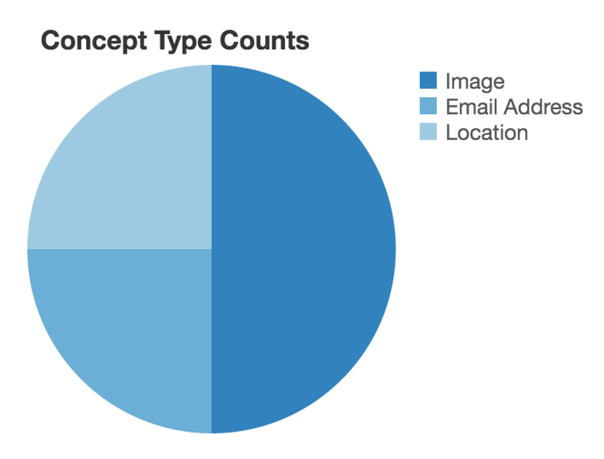
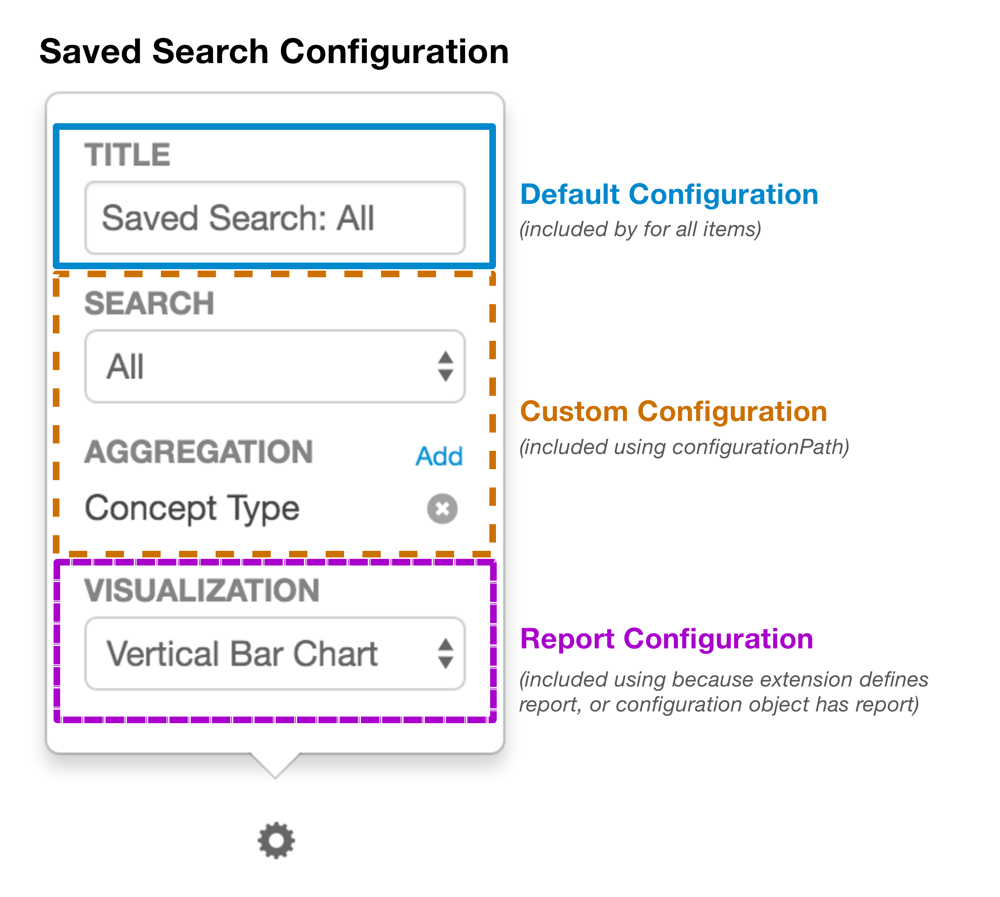

## Dashboard Items

The `org.visallo.web.dashboard.item` extension allows custom content to be rendered in a card on dashboards. They can be included in defaults dashboards using the `org.visallo.web.dashboard.layout` extension, or added manually by users. All built-in items are defined in [`registerDefaultItems.js`](https://github.com/v5analytics/visallo/blob/master/web/war/src/main/webapp/js/dashboard/registerDefaultItems.js).

### Configuration Options

* `identifier` _(required)_ `[String]` Unique identifier for this type of dashboard item. Only used internally, not exposed to user.
* `title` _(required)_ `[String]` Title of card to display when users are choosing items.
* `description` _(required)_ `[String]` Description of card to display under title when users are choosing items.
* One of the following is required: `componentPath`, or `report`.
    * `componentPath` _(required)_ `[String]` Path to FlightJS component to render.
    * `report` _(required)_ `[Object]` Specify an aggregation report. 
* `configurationPath` _(optional)_ `[String]` Add custom configuration to the configure screen for this item.
* `grid` _(optional)_ `[Object]` Default sizing of item in grid.
    * `width` _(optional)_ `[Number]` Width in grid cells `1-12`
    * `height` _(optional)_ `[Number]` Height in grid rows `> 0`
* `options` _(optional)_ `[Object]`
    * `flushContent` _(optional)_ `[Boolean]`: By default all cards get some default content padding, settings this to `true` will remove the padding.
    * `preventDefaultConfig` _(optional)_ `[Boolean]`: Set to `true` to disable the system adding a title configuration form.

### Using `componentPath`

#### Reflow

The dashboard adjusts the size of items based on the window width. If the component needs to adjust rendering based on size, register a `reflow` handler.

```js
this.on('reflow', this.onReflow);
```

*Consider using `_.throttle` or `_.debounce` to limit the cost of many reflow events from user resizing.*

#### Refresh

The dashboard includes a refresh button in the top left. If you would like to refresh content in response, register a `refreshData` handler.

```js
this.on('refreshData', this.onRefresh);
```

### Using `report`

Instead of specifying a component to render, specify a report template that requests data from the server and passes the results to a `reportRenderer` that can handle that data. The most common report uses search with aggregations configured.

An item can be a report if either: the extension defines the `report`, or a component registered with `componentPath` saves a `report` inside the items configuration, e.g. `item.configuration.report = { ... }`

#### Report Configuration

* `defaultRenderer` _(optional)_ `[String]` The identifier of a report renderer to use as default when adding this item.
* `endpoint` _(required)_ `[String]` The endpoint path to access the data. See [`Router`](https://github.com/v5analytics/visallo/blob/master/web/web-base/src/main/java/org/visallo/web/Router.java) for all available endpoints.
* `endpointParameters` _(optional)_ `[Object]` Parameters to pass to endpoint.
* `mapping` _(optional)_ `[Object]` Custom configuration for mapping results.
    * `transformerModulePath` _(optional)_ `[String]` RequireJS path to function that can transform the endpoint results to something a reportRenderer can handle. Only necessary if aggregations or search aren't used.
* `clickHandlerModulePath` _(optional)_ `[String]` RequireJS path to a function that handles click events. Called with arguments: `target`, `object.`

The example below defines a report to count all unique concept types, and set the default renderer to a pie chart.

```js
registry.registerExtension('org.visallo.web.dashboard.item', {
    title: 'Concept Type Counts',
    description: 'Show total counts for entity types',
    identifier: 'org-visallo-web-dashboard-concept-counts',
    report: {
        defaultRenderer: 'org-visallo-pie',
        endpoint: '/vertex/search',
        endpointParameters: {
            q: '*',
            size: 0,
            filter: '[]',
            aggregations: [
                {
                    type: 'term',
                    name: 'field',
                    field: 'http://visallo.org#conceptType'
                }
            ].map(JSON.stringify)
        }
    }
});
```




##### Search Edgepoints

* `vertex/search`: Only return vertices.
* `edge/search`: Only return edges.
* `element/search`: Search both vertices and edges.

##### Search Edgepoint Parameters

* `q` _(required)_ `[String]` Search query, or asterisk.
* `size` _(optional)_ `[Number]` Number of results to limit to, use `0` if using aggregations.
* `offset` _(optional)_ `[Number]` Index of results to start.
* `filter` _(required)_ `[Array]` List of filter properties.
    * `propertyName` _(required)_ `[String]` Iri of property name to filter.
    * `predicate` _(required)_ `[String]` Type of filter operation `has`, `hasNot`, `equal`, `contains`, `range`, `<`, `>`
    * `values` _(optional)_ `[Array]` Value(s) to apply to predicate.
* `aggregations` _(optional)_ `[Array]` List of aggregations to apply, each item is json string.
    * `type` _(required)_ `[String]` Type of aggregation: `term`, `geohash`, `histogram`
        * `term` Group by value of `field` and return counts.
        * `geohash` Group by value of `field` with geohash [`precision` _(required)_](https://www.elastic.co/guide/en/elasticsearch/reference/current/search-aggregations-bucket-geohashgrid-aggregation.html) and return counts.
        * `histogram` Group range (specified by [`interval` _(required)_](https://www.elastic.co/guide/en/elasticsearch/reference/current/search-aggregations-bucket-histogram-aggregation.html)) of values and their counts.
        * `statistics` Statistics for property: [`min`, `max`, `count`, `average`, `sum`](https://www.elastic.co/guide/en/elasticsearch/reference/current/search-aggregations-metrics-stats-aggregation.html).
    * `name` _(required)_ `[String]` Name the aggregation that's returned with results. Useful when more than one aggregation is used.
    * `field` _(required)_ `[String]` Property name iri to aggregate.


### Custom Configuration Interface Elements



Provide a `configurationPath` to the extension to add an additional user interface component in the configure popover. The figure describes how the configuration interface is generated for the saved search dashboard item. 

The possible configuration can come from:
* Default configuration (edit title)
* Extension specific (configuration defined in extension `configurationPath`)
* Report configuration (choose which reportRenderer)
* Report choosen configuration (Report defined `configurationPath`)

The configuration component gets attributes of the item when opened.

* `extension` The extension registered
* `item` The item instance which includes `configuration`

To update an items configuration, trigger `configurationChanged`.

```js
this.attr.item.configuration.myConfigOption = 'newValue';
this.trigger('configurationChanged', {
    extension: this.attr.extension,
    item: this.attr.item
});
```
