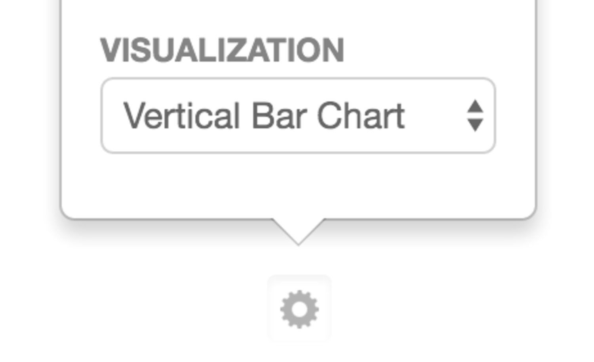
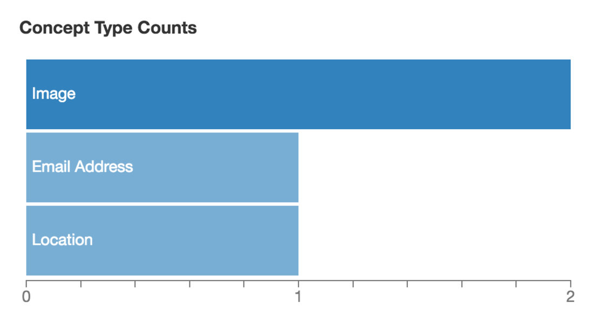
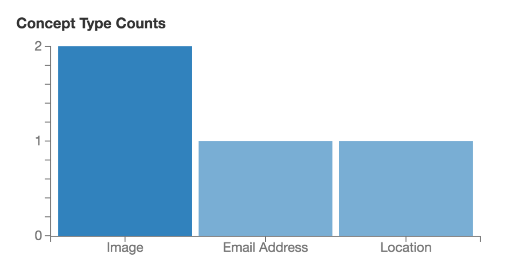
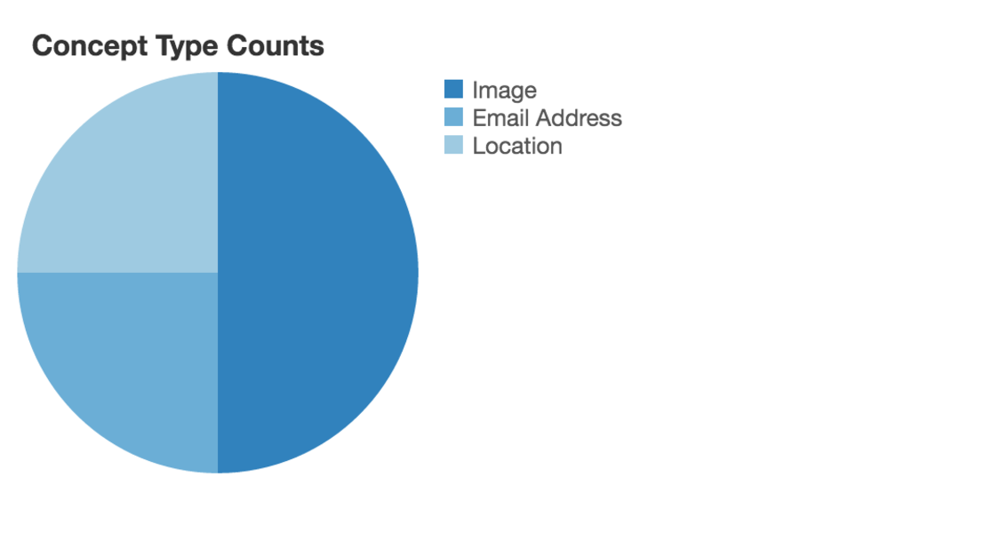
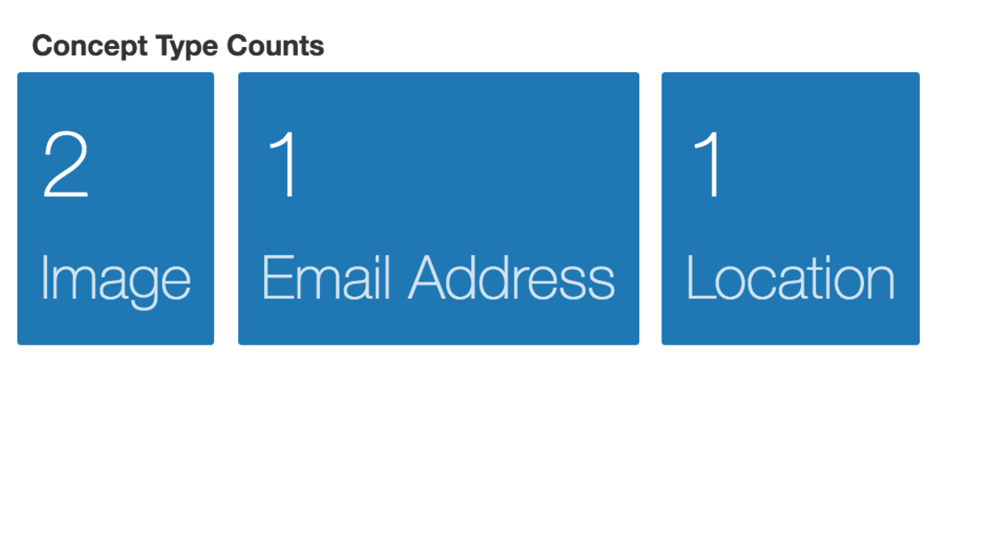
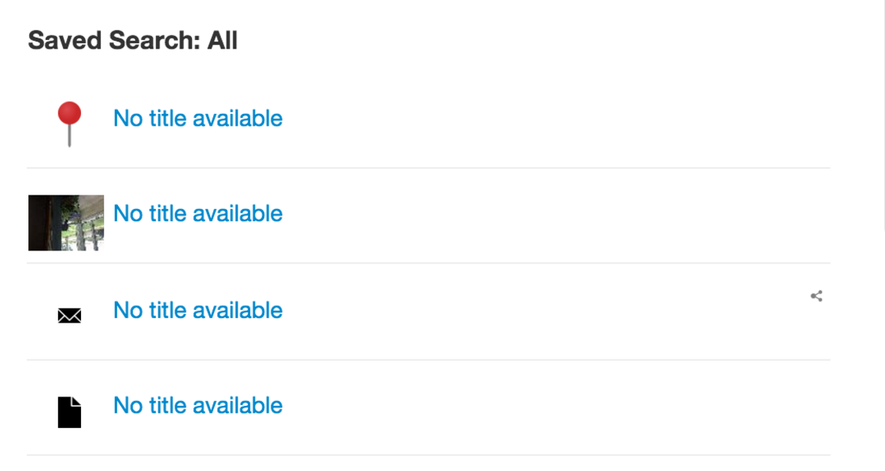

## Dashboard Report Renderer



The `org.visallo.web.dashboard.reportrenderer` extension adds additional output types for dashboard items that define a `report` or `item.configuration.report`.

There are several built-in renderers defined in [`reportRenderers.js`](https://github.com/v5analytics/visallo/blob/master/web/war/src/main/webapp/js/dashboard/reportRenderers.js).

### Configuration Options

* `identifier` _(required)_ `[String]` Unique identifier for this type of renderer. Can be referenced by dashboard report item using `defaultRenderer: [id]` in report configuration.
* `supportsResponse` _(required)_ `[Function]` Return `true` if this renderer can handle the `data` argument passed to it.
* `label` _(required)_ `[String]` Shown in the configuration interface (shown above) in _Visualization_ section.
* `componentPath` _(required)_ `[String]` RequireJS path to renderer component
* `configurationPath` _(optional)_ `[String]` RequireJS path to extra configuration.


### Component

The custom report renderer can mixin [`dashboard/reportRenderers/withReportRenderer.js`](https://github.com/v5analytics/visallo/blob/master/web/war/src/main/webapp/js/dashboard/reportRenderers/withRenderer.js) which provides:
* Automatically requesting data using endpoint configuration
* Handling refresh and reflow events
* Basic click handling if aggregations found
* Error Handling

#### Component Attributes

* `this.attr.report` Report configuration
* `this.attr.item` Dashboard item instance
    
#### `withReportRenderer` Mixin

If the renderer uses the mixin, the only function required is `render`. Optionally a `processData` function can be defined to transform the raw server results. It's better to process the data in `processData` function instead of `render` because it will run once on `refreshData` events, instead of on every `reflow` event.

The render function is called with 4 parameters

    render(d3, svgNode, data, d3tip);

* `d3` `[Object]` The d3 library object
* `node` `[DomElement]` The dom element to populate
* `data` `[?]` The response from the server (after processData)
* `d3tip` `[Object]` The d3tip library object (for tooltips)


Here is an example renderer:

```js
define(['flight/lib/component', './withRenderer'],
    function(defineComponent, withReportRenderer) {
        return defineComponent(MyReportRenderer, withReportRenderer)
        function MyReportRenderer() {
            // Optional
            // this.processData = function(data) { ... };

            this.render = function(d3, node, data, d3tip) {
                d3.select(node).text(JSON.stringify(data));
            }
        }
    }
);
```

### Built-In Report Renderers

<style>
figure { clear: both; }
figure img { float: left; margin-right: 0.5em; } 
</style>

<figure>
    
    <figcaption>
        <code>org-visallo-bar-horizontal</code>
        <p>Horizontal bar chart, also supports stacked bars if 2 aggregations provided.
    </figcaption>
</figure>

<figure>
    
    <figcaption>
        <code>org-visallo-bar-vertical</code>
        <p>Vertical bar chart, also supports stacked bars if 2 aggregations provided.
    </figcaption>
</figure>

<figure>
    
    <figcaption>
        <code>org-visallo-pie</code>
        <p>A classic pie chart
    </figcaption>
</figure>

<figure>
    
    <figcaption>
        <code>org-visallo-text-overview</code>
        <p>Text cards that show number and text.
    </figcaption>
</figure>

<figure>
    
    <figcaption>
        <code>org-visallo-element-list</code>
        <p>Standard list of elements, used in search results.
    </figcaption>
</figure>

