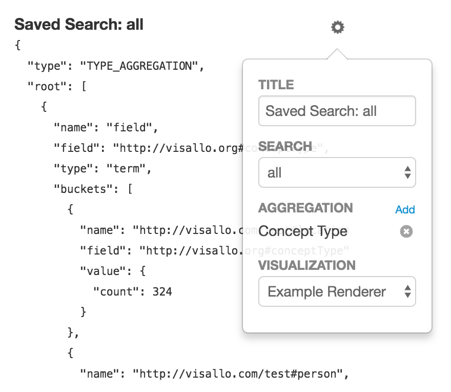

# Dashboard Report Renderer

* [Dashboard Report Renderer JavaScript API `org.visallo.dashboard.reportrenderer`](../../../javascript/org.visallo.dashboard.reportrenderer.html)
* [Dashboard Report Renderer Example Code](https://github.com/visallo/doc-examples/tree/master/extension-dashboard-reportrenderer)

Adds additional output types for dashboard items that define a `report` or `item.configuration.report`.

There are several built-in renderers defined in [`reportRenderers.js`](https://github.com/visallo/visallo/blob/master/web/war/src/main/webapp/js/dashboard/reportRenderers.js).

## Tutorial

For this tutorial, we'll create a new JSON renderer that simply takes the result, formats it, then prints it.

### Create Web Plugin

Register the resources to define the extension and the referenced component.



### Register the Extension

Register the new report renderer. It will accept any response.



### Define the Renderer

Create the renderer component and include the mixin.



Now, implement the processData and render functions

    

## Renderer Mixin

The custom report renderer can mixin [`dashboard/reportRenderers/withReportRenderer.js`](https://github.com/visallo/visallo/blob/master/web/war/src/main/webapp/js/dashboard/reportRenderers/withRenderer.js) which provides:
* Automatically requesting data using endpoint configuration
* Handling refresh and reflow events
* Basic click handling if aggregations found
* Error handling

If the renderer uses the mixin, the only function required is `render`. Optionally, a `processData` function can be defined to transform the raw server results. It's better to process the data in `processData` function instead of `render` because it will run once on `refreshData` events, instead of on every `reflow` event.

## Built-In Report Renderers

<figure>
    
    <figcaption>
        <code>org-visallo-bar-horizontal</code>
        
Horizontal bar chart, also supports stacked bars if two aggregations provided.
    </figcaption>
</figure>

<figure>
    
    <figcaption>
        <code>org-visallo-bar-vertical</code>
        
Vertical bar chart, also supports stacked bars if two aggregations provided.
    </figcaption>
</figure>

<figure>
    
    <figcaption>
        <code>org-visallo-pie</code>
        
A classic pie chart.
    </figcaption>
</figure>

<figure>
    
    <figcaption>
        <code>org-visallo-text-overview</code>
        
Text cards that show number and text.
    </figcaption>
</figure>

<figure>
    
    <figcaption>
        <code>org-visallo-element-list</code>
        
Standard list of elements, used in search results.
    </figcaption>
</figure>

