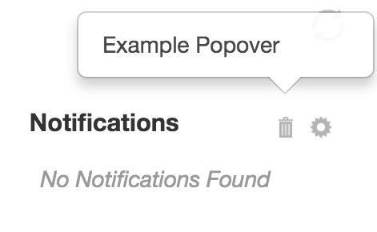

# Dashboard Toolbar Item

* [Dashboard Toolbar Item JavaScript API `org.visallo.dashboard.toolbar.item`](../../../javascript/org.visallo.dashboard.toolbar.item.html)
* [Dashboard Toolbar Item Example Code](https://github.com/visallo/doc-examples/tree/master/extension-dashboard-toolbaritem)

Allows custom buttons to be rendered next to the cards configuration button. These buttons (displayed as icons) can send an event on click, or specify content to be rendered in a popover.

<div style="text-align:center">

</div>

## Tutorial

### Web Plugin

Register resources for the plugin, the component, and the toolbar icon.



### Register Extension

Register the toolbar extension, specifying the component that will be rendered in a popover on click, and icon.



### Create Popover Component

The popover component must be flight component, this one just renders some text. The dashbord handles the creation of the popover and simply renders this component in the content area.



If content is updated in the popover and the size changes, the component should trigger an event to notify the popover parent component. This will adjust the anchor point to match the size change.

```js
this.trigger('positionDialog');
```
