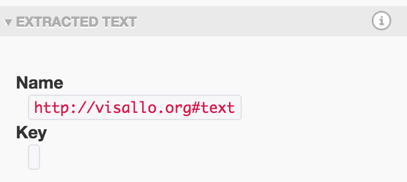

## Detail Text

Create extensions for `org.visallo.detail.text` to replace the default text collapsible section content in the detail pane. 

<div class="alert alert-warning">
The console will show a warning if multiple extensions are found for a given vertex, name, and key. The extension used is non-deterministic.
</div>

### Configuration Options

* `shouldReplaceTextSectionForVertex` _(required)_ `[Function]`

    Set a function to determine the if this extension should replace a particular text section for a vertex. Return `true` to replace the text section content with the component referenced by `componentPath`.
    
    Called with 3 arguments:

    * `vertex` `[Object]`
    * `propertyName` `[String]`
    * `propertyKey` `[String]`


* `componentPath` _(required)_ `[String]`
    
    Specifies the path to a component that will be attached to the content of the text section when it's expanded.

    The component is passed 3 attributes:

    * `vertex` `[Object]`
    * `propertyName` `[String]`
    * `propertyKey` `[String]`

### Example

Override all text sections and just display the name and key of the property.

```js
registry.registerExtension('org.visallo.detail.text', {
    shouldReplaceTextSectionForVertex: function(vertex, name, key) {
        return true;
    },
    componentPath: 'com-example-text-plugin'
});

define('com-example-text-plugin', ['flight/lib/component'],
function(defineComponent) {
    return defineComponent(ExampleTextPlugin);

    function ExampleTextPlugin() {
        this.after('initialize', function() {
            var { vertex, propertyName, propertyKey } = this.attr;
            console.log(vertex);
            this.$node.html(`
                name: <code>${propertyName}</code>
                <br>
                key: <code>${propertyKey}</code>
            `);
        })
    }
});
```


