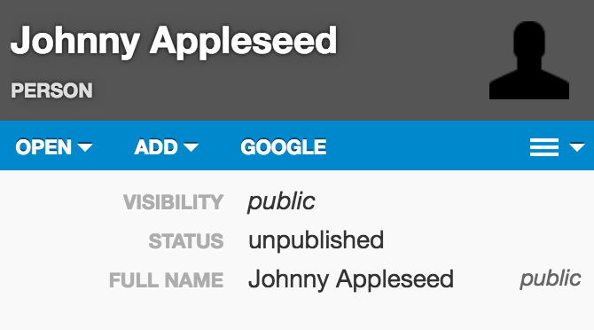

# Element Inspector Toolbar

* [Element Inspector Toolbar JavaScript API `org.visallo.detail.toolbar`](../../../javascript/org.visallo.detail.toolbar.html)
* [Element Inspector Toolbar Example Code](https://github.com/visallo/doc-examples/tree/master/extension-detail-toolbar)

Allows additional toolbar items to be added to the Element Inspector.

## Tutorial

### Web Plugin

Register the resources needed.



### Register Extension

Now, register the toolbar item.



### Listen

Register a document-level listener for the event specified in the extension. The [`formatters.vertex.title`](../../../javascript/module-formatters.vertex.html#.title) function transforms an element into a title string using the ontology title formula.


