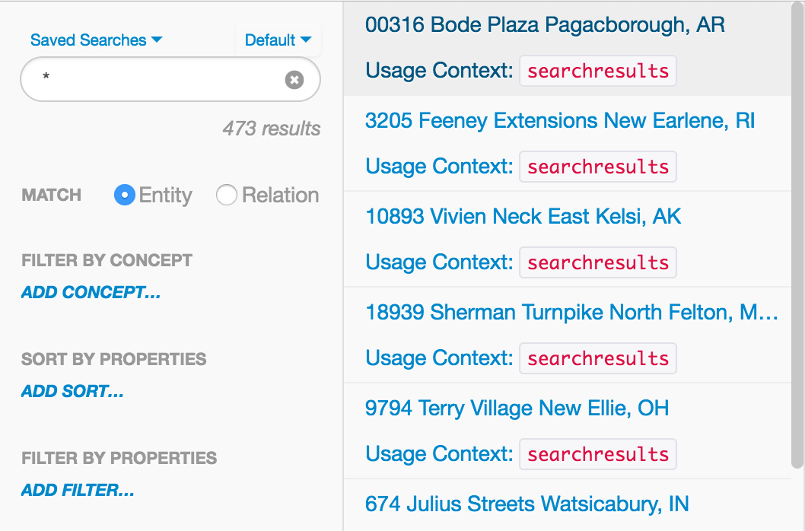

# Element List Item Renderer

* [Element List Item Renderer JavaScript API `org.visallo.entity.listItemRenderer`](../../../javascript/org.visallo.entity.listItemRenderer.html)
* [Element List Item Renderer Example Code](https://github.com/visallo/doc-examples/tree/master/extension-entity-listitemrenderer)

This allows plugins to adjust how list items are displayed in search results, details panels, or anywhere else the [Element List Component](../../../javascript/module-components_List.html) is used.

## Tutorial

### Web Plugin

Register the resources needed.



### Register Extension

Now, register the item renderer. It will only override when the `usageContext` is `searchresults`. Some contexts send different input as the `item` parameter, so its recommended to accept specific contexts, rather than support all contexts.



### Create the Component

Create a Flight component that will render each row.



Render the template using the item, and [`formatters.vertex.title`](../../../javascript/module-formatters.vertex.html#.title) to get the title.



Remember to set the `vertexId` (or `edgeId`) in data of the element, for selection to work correctly.



To display an image in the row, wait for the `loadPreview` event that notifies the component that it has scrolled into view. As this event might be called many times, we ensure `onLoadPreview` is only ever called once using underscore.js `_.once`.



The image path returned from [`formatters.vertex.image`](../../../javascript/module-formatters.vertex.html#.image) function might be the concept icon, check if it is using [`formatters.vertex.imageIsFromConcept`](../../../javascript/module-formatters.vertex.html#.imageIsFromConcept) is so we can style it differently.



### Custom CSS

To customize styling, add a class to the `node`.





When the row is selected the list element will have an `active` class. Certain elements may need to adjust to be visible with the blue selection background. The example changes the image border color:


