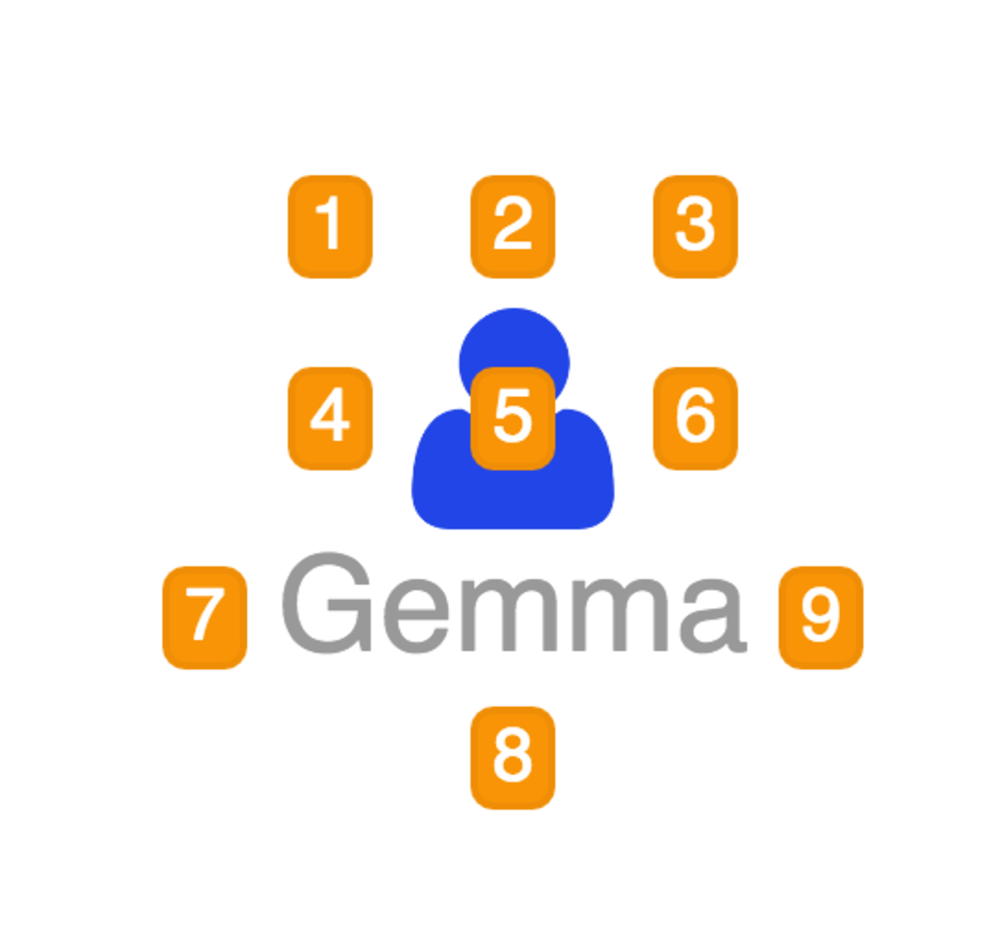
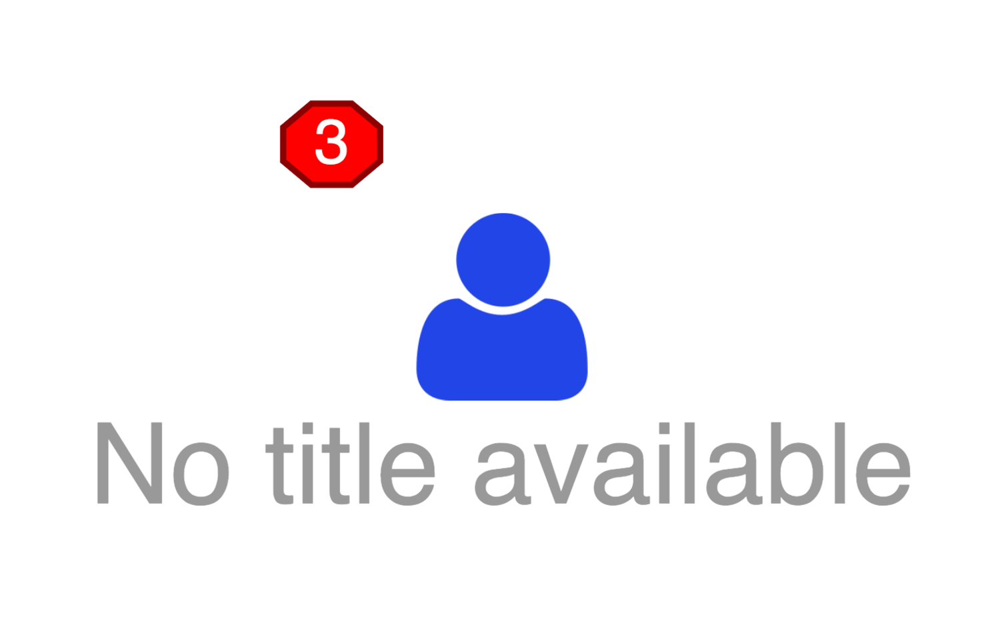
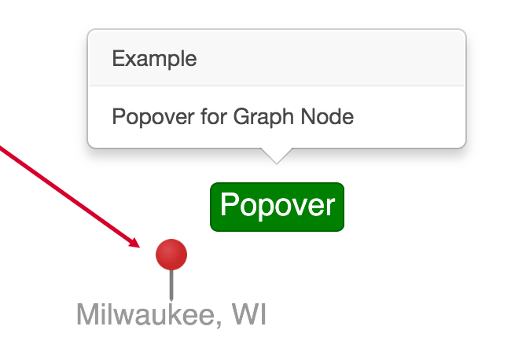

## Graph Decorations

Graph Decorations are additional detail to display around a vertex when displayed in a graph. These decorations are implemented as [cytoscape.js](http://js.cytoscape.org) nodes inside of compound nodes. That allows them to be styled just like vertices using [`org.visallo.graph.style`](../graphStyle) extensions.

### Configuration Options

* `applyTo` _(optional)_ `[Function]`

    Set a function to determine the if this decorator should apply to a vertex. If function is not provided, this decoration will apply to all vertices.
    
    Called with one argument: `vertex` `[Object]`.

* `alignment` _(required)_ `[Object]`
    
    Specifies the position that the decoration is placed relative to vertex. It must contain 2 keys: `h`, and `v`.

    * `h`: Horizontal alignment must be one of: `left`, `center`, `right`.
    * `v`: Vertical alignment must be one of: `top`, `center`, `bottom`.

* `classes` _(optional)_ `[String|Array|Function]`

    Class names to add to cytoscape node. This is most used with an [`org.visallo.graph.style`](../graphStyle) extension.

    * `String`: Whitespace-separated string of class names
    * `Array`: Array of strings of class names
    * `Function`: Function that returns an array or string of classes.
        Arguments:
        * `vertex`: The vertex object that this decoration is applied to.

* `data` _(optional)_ `[Object|Function]`

    Provides the `data` object for cytoscape decoration node. The `label` key is by default the text string, but can be changed using custom classes/stylesheets.

    * `Object`: The data object
    * `Function`: Passed a `vertex` object as first argument. Can return either a `data` object or a `Promise`

    _**Note:** This will be called for every vertex change event (`verticesUpdated`). Cache the result if possible._

* `onCreate` _(optional)_ `[Function]`

    This function is called after the cytoscape decoration node is created.

    * Arguments: _none_
    * Context: Cytoscape node

* `onClick` _(optional)_ `[Function]`

    This function is called on click events.

    * Arguments: `event`, `data`
        * `event` `[Event]`: Actual DOM event (with cytoscape additions)
        * `data` `[Object]`: Object with `vertex`, and `cy`
    * Context: Cytoscape node

* `onMouseOver` _(optional)_ `[Function]`

    This function is called on mouseover events.

    * Arguments: `event`, `data`
        * `event` `[Event]`: Actual DOM event (with cytoscape additions)
        * `data` `[Object]`: Object with `vertex`, and `cy`
    * Context: Cytoscape node

* `onMouseOut` _(optional)_ `[Function]`

    This function is called on mouseout events.

    * Arguments: `event`, `data`
        * `event` `[Event]`: Actual DOM event (with cytoscape additions)
        * `data` `[Object]`: Object with `vertex`, and `cy`
    * Context: Cytoscape node

### Alignment Positions

The figure below shows the available positions. The alignment locations are automatically adjusted based on the placement of the text in a node.

Annotated positions and `alignment` configuration value:

1. Top Left `{ h: 'left', v: 'top' }`
1. Top Center `{ h: 'center', v: 'top' }`
1. Top Right `{ h: 'right', v: 'top' }`
1. Center Left `{ h: 'left', v: 'center' }`
1. Center Center `{ h: 'center', v: 'center' }`
1. Center Right `{ h: 'right', v: 'center' }`
1. Bottom Left `{ h: 'left', v: 'bottom' }`
1. Bottom Center `{ h: 'center', v: 'bottom' }`
1. Bottom Right `{ h: 'right', v: 'bottom' }`

_**Note:** There is no collision detection on decorations with equal alignments_

### Example

Create a decoration that applies to all nodes that shows the number of properties in the top left corner. Add a style extension to change the default shape and color of the decoration.

    registry.registerExtension('org.visallo.graph.node.decoration', {
        applyTo: function(v) { return true; },
        alignment: { h: 'left', v: 'top' },
        classes: 'custom',
        data: function(vertex) {
            return {
                label: vertex.properties.length
            }
        }
    })

    registry.registerExtension('org.visallo.graph.style', function(style) {
        style
            .selector('.decoration.custom')
            .css({
                shape: 'octagon',
                'background-color': 'red',
                'border-color': 'darkred',
                'padding-left': 10,
                'padding-right': 10
            })
    })

### Decoration with Custom Popover

Popovers can be attached to decorations using a `decorationId` as the anchor.

    registry.registerExtension('org.visallo.graph.node.decoration', {
        alignment: { h: 'left', v: 'top' },
        onClick: function(event, data) {
            var id = this.id();
            // CustomPopover should mixin util/popovers/withPopover
            // See examples in util/popovers...
            CustomPopover.attachTo(data.cy.container(), {
                anchorTo: {
                    decorationId: id
                }
            });
        },
        data: { label: 'Click Me' }
    })

