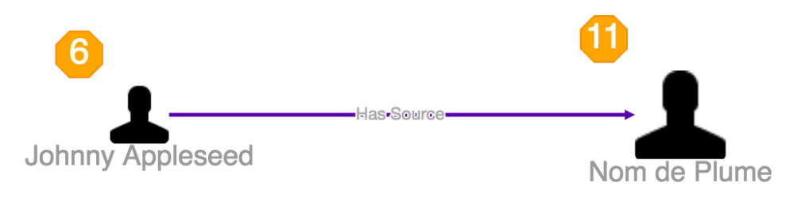

# Graph Node Decoration

* [Graph Node Decoration JavaScript API `org.visallo.graph.node.decoration`](../../../javascript/org.visallo.graph.node.decoration.html)
* [Graph Node Decoration Example Code](https://github.com/visallo/doc-examples/tree/master/extension-graph-node-decoration)

Graph node decorations are additional detail to display around a vertex when displayed in a graph. These decorations are implemented as [Cytoscape](http://js.cytoscape.org/) nodes inside of compound nodes. That allows them to be styled just like vertices using `org.visallo.graph.style` extensions.

Decorations can have performance impact on the graph.

Once a node displays a decoration, another container node is created that is never removed. Also each decoration is a full cytoscape node.

## Alignment Positions

The figure below shows the available positions. The alignment locations are automatically adjusted based on the placement of the text in a node.

Annotated positions and `alignment` configuration value:

1. Top left `{ h: 'left', v: 'top' }`
1. Top center `{ h: 'center', v: 'top' }`
1. Top right `{ h: 'right', v: 'top' }`
1. Center left `{ h: 'left', v: 'center' }`
1. Center center `{ h: 'center', v: 'center' }`
1. Center right `{ h: 'right', v: 'center' }`
1. Bottom left `{ h: 'left', v: 'bottom' }`
1. Bottom center `{ h: 'center', v: 'bottom' }`
1. Bottom right `{ h: 'right', v: 'bottom' }`

_**Note:** There is no collision detection on decorations with equal alignments_.

## Tutorial

### Web Plugin

Register the plugin script in a web plugin.



### Register Extension

Register the decoration extension for a new decoration in the top-left corner of nodes. This decoration will apply to all vertices that have a comment, and display the number of comments in the decoration.



The default graph stylesheet defines `label` as the content of the node.



Register a style extension to format the decoration. All decorations have the `decoration` class, so append that to the selector to avoid conflicts with node classes.



## Popover Tutorial

Decorations can have popovers that are opened when the user clicks on the decoration using the `onClick` handler.

### Web Plugin

Register the popover component and template.



### Register Extension

Register the decoration with an `onClick` handler.



### Popover Component

Create the Flight component to render the popover.



The `withPopover` mixin provides the popover specific handling to attach to the decoration.

Add the template with the necessary markup for the popover.



The popover mixin calls `setupWithTemplate` to initialize the popover, so if extra work is needed to be done after the template has rendered, use `after('setupWithTemplate')`. `this.dialog` and `this.popover` are instance variables for the popover and the content.
