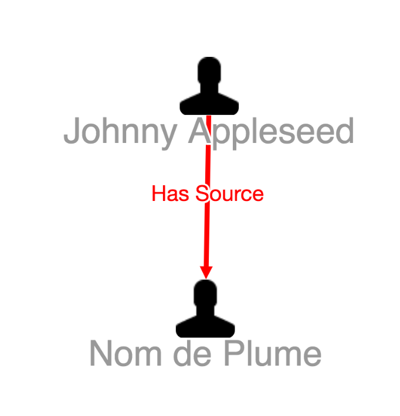

# Graph Edge Class

* [Graph Edge Class JavaScript API `org.visallo.graph.edge.class`](../../../javascript/org.visallo.graph.edge.class.html)
* [Graph Edge Class Example Code](https://github.com/visallo/doc-examples/tree/master/extension-graph-edge-class)

Function that can change [Cytoscape](http://js.cytoscape.org/) classes of edges. Useful for customizing the style of edges on the graph.

## Tutorial

### Web Plugin

Register a plugin file to register the extensions.



### Register Extension

Register the class extension that checks if any of the edges (they are by default bundled together by type) has a comment. If any of them do, add a class.



Register a style extension to test.


