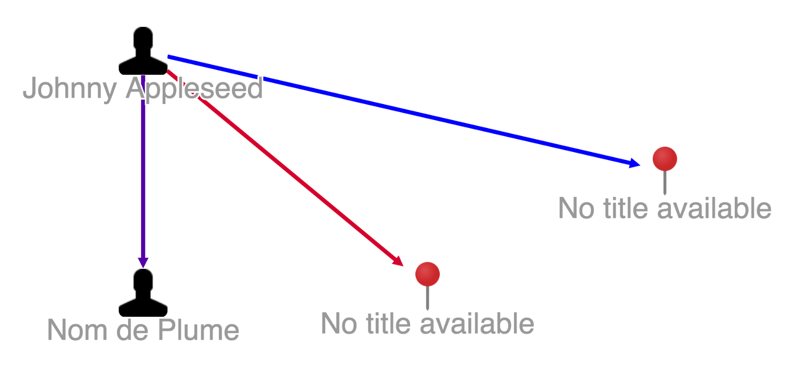

# Graph Edge Transformer

* [Graph Edge Transformer JavaScript API `org.visallo.graph.edge.transformer`](../../../javascript/org.visallo.graph.edge.transformer.html)
* [Graph Edge Transformer Example Code](https://github.com/visallo/doc-examples/tree/master/extension-graph-edge-transformer)

Register a function that can modify the [Cytoscape](http://js.cytoscape.org) edge data.

## Tutorial

## Web Plugin

Create a web plugin and register the plugin.



## Register Extension

Register the transformer that counts all the properties of the collapsed edges and sets a new data parameter called `numProperties`.



Create a style extension to test. We use `mapData` to interpolate the number into a color.


