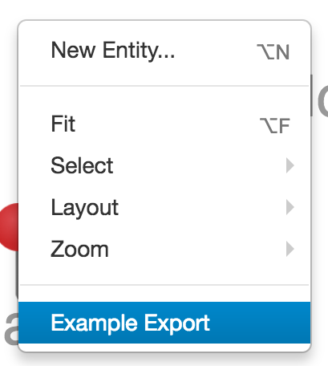
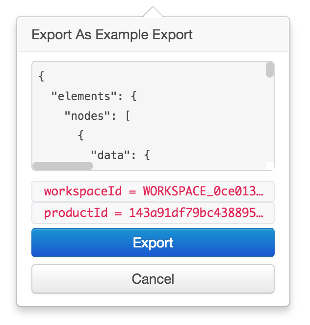

# Graph Export

* [Graph Export JavaScript API `org.visallo.graph.export`](../../../javascript/org.visallo.graph.export.html)
* [Graph Export Example Code](https://github.com/visallo/doc-examples/tree/master/extension-graph-export)

Register a function that can add a menu option in export context menu. If multiple export plugins are registered, they are placed in an "Export" submenu.

## Tutorial

### Web Plugin

Register the resources need for export, a plugin, component, template, stylesheet, and message bundle.



### Register Extension

Register the extension to add a menu item to the graph context menu.



### Define Component

Create the Flight component that logs the [Cytoscape](http://js.cytoscape.org/) `json` backup.



### Style

Add some stylesheet declarations in a wrapper class to avoid collisions with other plugins.



