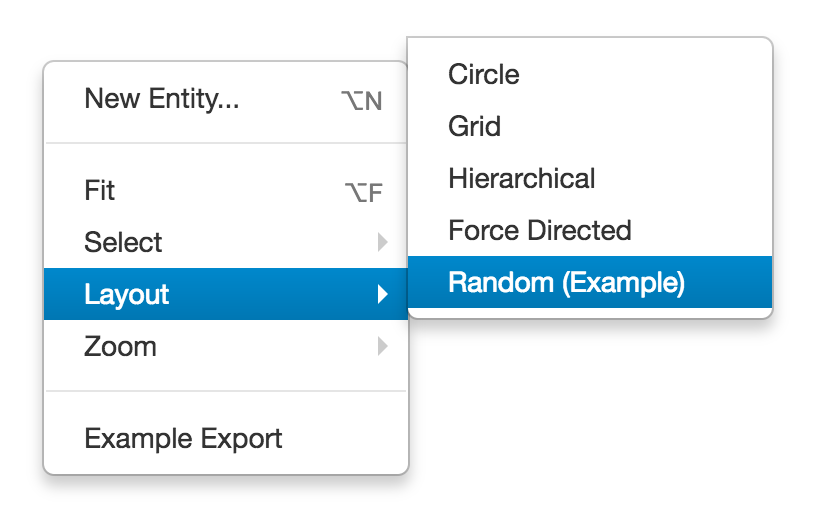

# Graph Layout

* [Graph Layout JavaScript API `org.visallo.graph.layout`](../../../javascript/org.visallo.graph.layout.html)
* [Graph Layout Example Code](https://github.com/visallo/doc-examples/tree/master/extension-graph-layout)

Plugin to add [Cytoscape layouts](http://js.cytoscape.org/#layouts)

## Tutorial

### Web Plugin

Register resources for the plugin and message bundle.



### Register Extension

Register the layout extension.



### Create the Layout Class

The layout class is initialized with options for the layout. These options include the `cy` instance and the elements (`eles`) to layout. These should be filtered to real vertices `.filter('.v')` so we are not moving decorations.



The positions are generated using a random number using the current window width. The use of `retina.pointsToPixels` allows transformation from virtual points to actual screen pixels in the case of a hidpi display.



### Message Bundle

Add a i18n value in a MessageBundle.properties. This will be displayed in the graph context menu.



