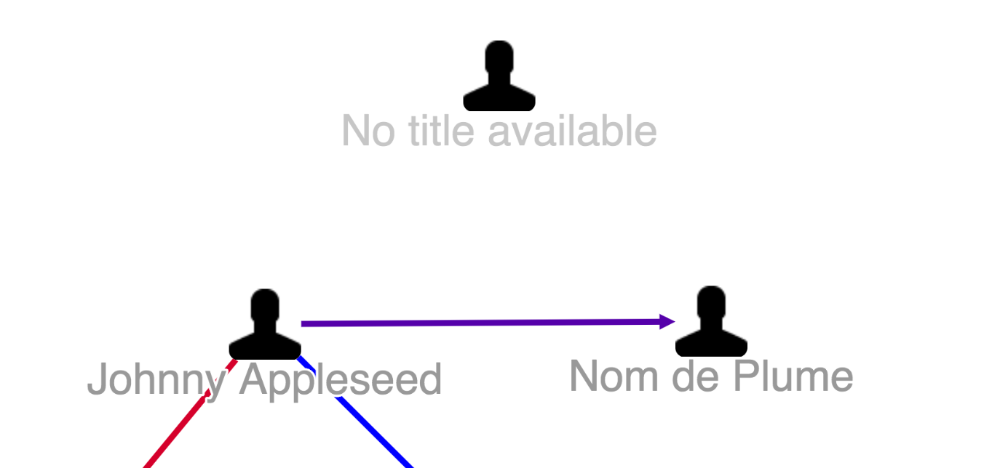

# Graph Node Class

* [Graph Node Class JavaScript API `org.visallo.graph.node.class`](../../../javascript/org.visallo.graph.node.class.html)
* [Graph Node Class Example Code](https://github.com/visallo/doc-examples/tree/master/extension-graph-node-class)

Register a function that can add or remove classes from [Cytoscape](http://js.cytoscape.org/) nodes for custom styling.

## Tutorial

### Web Plugin

Register the plugin script in a web plugin.



### Register Extension

Register the class extension and apply a `unknownName` class when the vertex is a person with no name property.



Register a style extension to test the behavior by adjusting the opacity.


