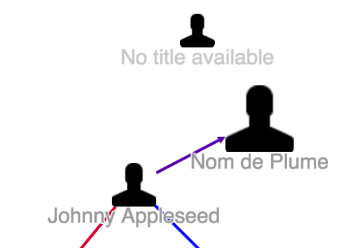

# Graph Node Transformer

* [Graph Node Transformer JavaScript API `org.visallo.graph.node.transformer`](../../../javascript/org.visallo.graph.node.transformer.html)
* [Graph Node Transformer Example Code](https://github.com/visallo/doc-examples/tree/master/extension-graph-node-transformer)

Allows extensions to adjust the data attribute of [Cytoscape](http://js.cytoscape.org/) nodes.

## Tutorial

This tutorial will adjust the size of graph nodes based on how many properties they have.

### Web Plugin

Register the plugin script in a web plugin.



### Register Extension

Register the transformer extension that just places a property count into the data object.



Register a style extension to test the transformer. The selector checks for the data property and adjusts the size of the node depending on `numProperties`.



The function uses `devicePixelRatio` to be the same perceived size on hidpi and normal displays. The default Cytoscape stylesheet does something similar.



