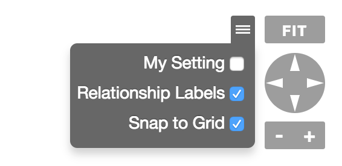

# Graph Options

* [Graph Options JavaScript API `org.visallo.graph.options`](../../../javascript/org.visallo.graph.options.html)
* [Graph Options Example Code](https://github.com/visallo/doc-examples/tree/master/extension-graph-options)

Plugin to add custom options components (Flight or React) which display in the graph options menu (next to Fit) when the menu is opened.

## Tutorial

For this tutorial we'll create a new options extension that adds a preferenced-backed checkbox. This could be used for toggling some built-in graph styles, for example.

### Web Plugin

Register the plugin script and React component in a web plugin.



### Register Extension

Register the options extension pointing to the React component.



### Component

Create the component that renders a checkbox, and looks up user preferences.



Implement the saving of the preference when the user clicks the checkbox. This updates the in memory user object, and updates the server.



* [`dataRequest API`](../../../javascript/module-dataRequest.html)
* [`User Service -> Set Preference API`](../../../javascript/module-services_user.html#.preference)
