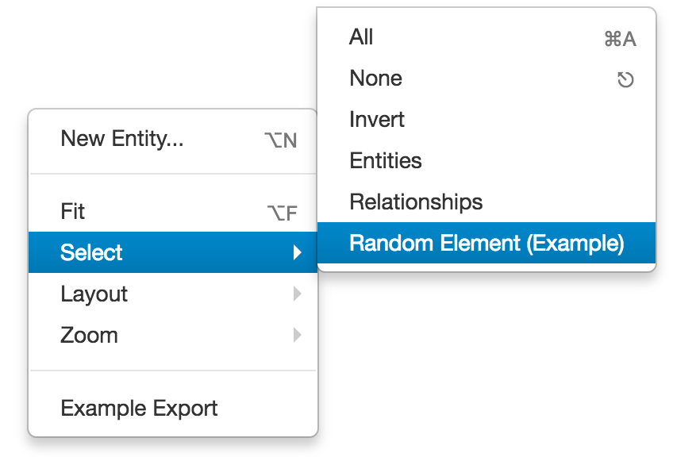

# Graph Selection

* [Graph Selection JavaScript API `org.visallo.graph.selection`](../../../javascript/org.visallo.graph.selection.html)
* [Graph Selection Example Code](https://github.com/visallo/doc-examples/tree/master/extension-graph-selection)

Add custom [Cytoscape](http://js.cytoscape.org/) selection menu items. Graph provides select all, none, and invert by default.

## Tutorial

This tutorial will create a selection menu item to select a random node or edge.

### Web Plugin

Register the plugin script in a web plugin.



### Register Extension

Register the selection extension to find a random element and select it.



The `elements` function in cytoscape will return all nodes and edges. This includes decorations on nodes, and temporary edges used for find path, etc. Filter by `.v,.e` to include only _real_ vertices and edges.

