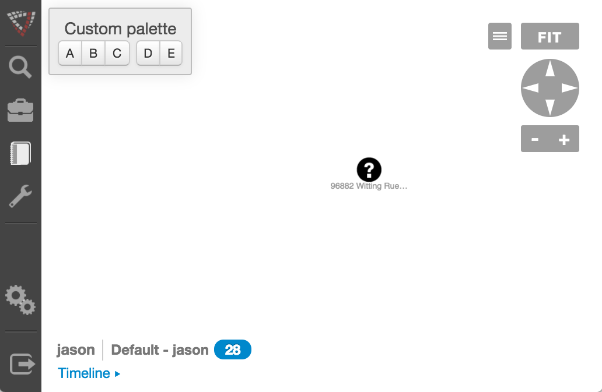

# Graph View

* [Graph View JavaScript API `org.visallo.graph.view`](../../../javascript/org.visallo.graph.view.html)
* [Graph View Example Code](https://github.com/visallo/doc-examples/tree/master/extension-graph-view)Graph View Plugin

Plugin to add custom view components which overlay the graph. Used for toolbars, etc., that interact with the graph.

Views can be Flight or React components and should be styled to be absolutely positioned. The absolute position given is relative to the graph. 0,0 is top-left corner of graph. 

## Tutorial

### Web Plugin

Register the plugin script, React component, and less in a web plugin.



### Register Extension

Register the options extension pointing to the React component.



### Component

Create the graph view component. This one will be like a floating toolbar panel.



### Style

The less style file is wrapped in the class name defined in the component to avoid conflicts with other plugins and core Visallo styles.


