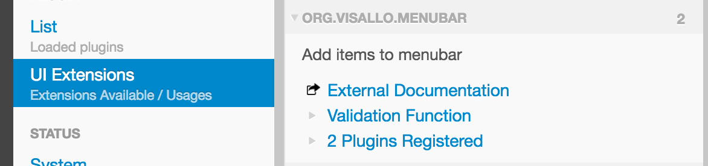

# Extension Points

Extension points are places built into Visallo that can define additional behavior. Custom plugins can also define extension points that can be implemented by other plugins.

An extension point is simply a mapping from a string – the namespaced extension point name – to a JavaScript object. What kind of object is defined by the consumer of the extension point.

All registered extension points are viewable in the admin panel, under `UI Extensions`, and in the table of contents in this document. This document focuses on tutorials for the extension points, for code-level documentation, view the [Extension Point Api](../../javascript/extensionpoints.html).

## Register an extension point

To register some custom behavior, require the [`public/v1/api`](../../javascript/module-public_v1_api.html) module, and use the [`registry`](../../javascript/module-registry.html) member.

```js
require(['public/v1/api'], function(visallo) {
    var registry = visallo.registry;
    registry.registerExtension([extension point name], [extension point object])
})
```

For example, to add an item to the menu bar, use the [Menu bar extension point](./menubar/index.md):



Visallo plugins can also define their own extension points. They do not need to be defined ahead of time, simply ask the registry for all registered extensions using a unique point name. [`registry.extensionsForPoint`](../../javascript/module-registry.html#.extensionsForPoint)

```js
registry.extensionsForPoint([extension point name]);
// Returns array of registered objects
```

It is good practice to define some documentation for your new extension point. Documenting provides a validation function, and a description shown in the admin panel under UI Extensions. Document the extension point prior to requesting `extensionsForPoint`. [`registry.documentExtensionPoint`](../../javascript/module-registry.html#.documentExtensionPoint)



<div class="alert alert-info">
<p>If you call <code>documentExtensionPoint</code> before <code>extensionsForPoint</code> all the extensions returned are guaranteed to have passed validation.

<p>Invalid extensions are logged as warnings in the JavaScript console.
</div>

This documentation appears in the admin pane under UI Extensions. Add an external documentation URL using an optional 4th parameter.

```js
registry.documentExtensionPoint('com.example.point',
    'Description...',
    function () { return true; },
    'http://example.com/docs'
);
```




