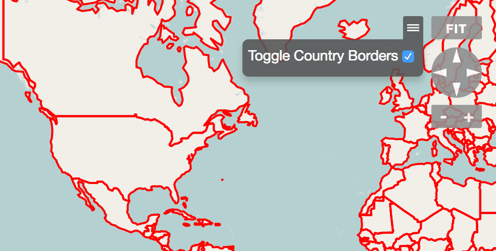

# Map Options

* [Map Options JavaScript API `org.visallo.map.options`](../../../javascript/org.visallo.map.options.html)
* [Map Options Example Code](https://github.com/visallo/doc-examples/tree/master/extension-map-options)

Add custom options components (Flight or React) which display in the map options menu (next to Fit).

## Tutorial

### Web Plugin

Register the plugin, and component scripts. Then register a file reference to the [geojson](https://github.com/visallo/doc-examples/blob/6e8b6766/extension-map-options/src/main/resources/org/visallo/examples/map_options/countries.geojson) of countries.



### Register Extension

Register the map options extension and point the path the the React component.



### Component

The react component manages the state of the geojson layer (visible/hidden) using a user preference, and uses the OpenLayers API to add/remove the vector layer.


