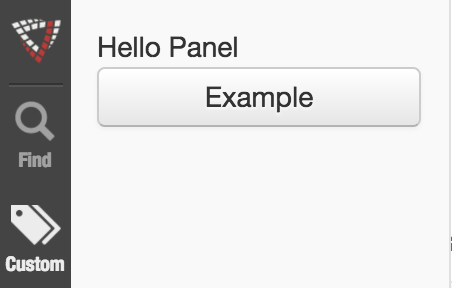
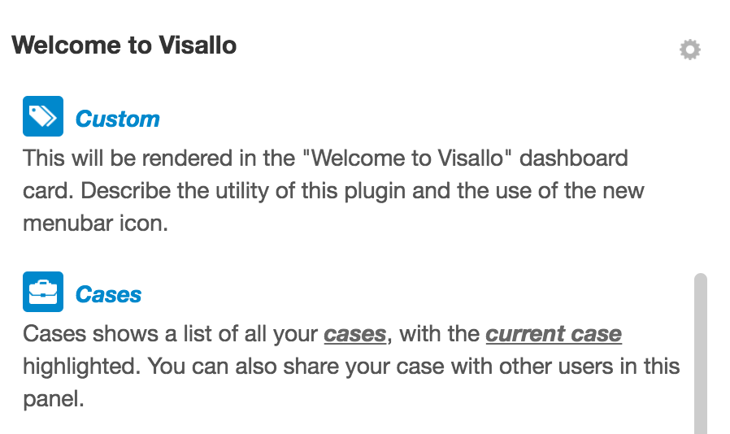

# Menu Bar

* [Menu Bar JavaScript API `org.visallo.menubar`](../../../javascript/org.visallo.menubar.html)
* [Menu Bar Example Code](https://github.com/visallo/doc-examples/tree/master/extension-menubar)

Add additional icons into the menu bar that can open a slide out panel or display a component in the content area like the built in dashboard.

The icon can refer to an existing icon [bundled with Visallo](https://github.com/visallo/visallo/tree/master/web/war/src/main/webapp/img/glyphicons/white), or one registered with `registerFile` in a plugin. For best results, use a white mono-chromatic icon.

## Tutorial

### Web Plugin

Register the plugin, a component for the pane, and a template for the _Welcome to Visallo_ card.



### Register Extension

Register the menu bar extension by pointing to the component and template. This one will use a bundled icon.



### Component

Create a basic React component that displays some text and a button. Add some padding around the panel to match other panes.



