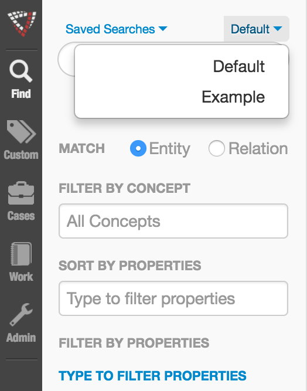
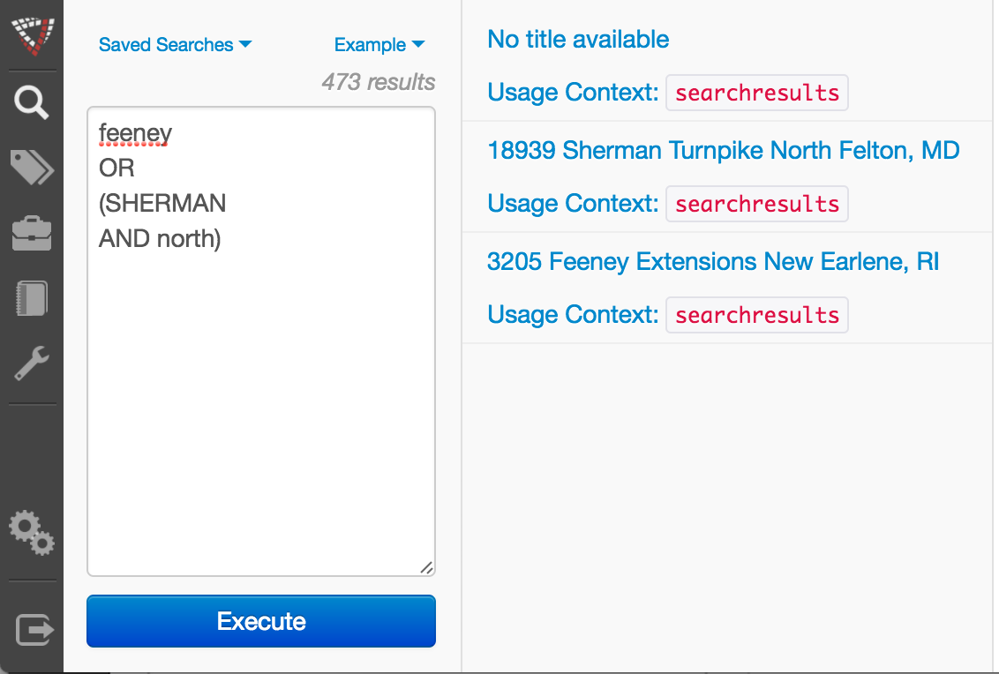

# Advanced Search

* [Advanced Search JavaScript API `org.visallo.search.advanced`](../../../javascript/org.visallo.search.advanced.html)
* [Advanced Search Example Code](https://github.com/visallo/doc-examples/tree/master/extension-search-advanced)

Provide users with alternate search interfaces through a dropdown in the search pane. These additional interfaces have their own saved searches and completely control the interaction of search.

Search extensions control how the search is executed and the results are displayed.

<div style="text-align:center">


</div>

## Tutorial

### Web Plugin

Register the plugin and a component/template for the new search interface.



The search extension requires a search URL used for saved searches, but we can use the built-in ones by just defining a new route. To access the route in the front-end we need to also add a services object in `worker.js`.



Defining a new services object extends what methods [`dataRequest`](../../../javascript/module-dataRequest.html) can access.



### Register Extension

Register the search extension pointing to a Flight component. The `savedSearchUrl` points to the route created previously.



### Search Component

Create the Flight component, it will be responsible for the UI, loading saved searches, executing searches, and displaying results.



#### Run Search and Display Results

Using the service created earlier, we can make a data request to run the search and get the result as a promise. Using the public API we access the `List` component for display.



The search results should be rendered in an element outside of the extension component. The search interface defines a container to use, and the CSS selector to that container is passed to all extension interfaces as the attribute `resultsSelector`.



The container HTML is structured as follows:

```html
<div class="{{ resultsSelector }}" style="display:none">
    <div class="content">
        <!-- results content should be here -->
        <!-- or attach element list to "content" node -->
    </div>
</div>
```

To display the results, render the List component into the results containers' `.content` element, switch the `display` style on the container to show it, and enable `infiniteScrolling`.



##### Infinite Scroll

To finish making infinite scroll work, we listen for events on the results. Note, we have to listen using the container since events won't bubble up to the extension container as its not a descendant.



Then, when we get notified of scrolling, make another search request with the given offset, and trigger an update to the List element.



#### Notify of Search Changes

All search extensions should notify via `setCurrentSearchForSaving` that the search has modified. This allows the extension to work with the Saved Searches component to save the current search. The `url` should match the `savedSearchUrl` defined in the extension.


