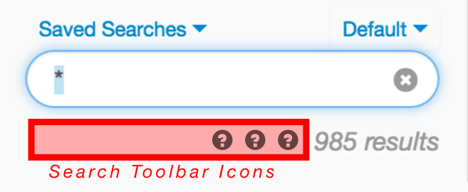

## Search Toolbar

Search toolbar items display below the search query input field. They have access to the current search query (if available), and can react to click events with content in a popover, or a custom event.



### Configuration Options

* `tooltip` _(required)_ `[String]`

    What to display in `title` attribute
    
* `icon` _(required)_ `[String]` 

    URL path to icon to display. Use monochromatic icon with black as color. Opacity is adjusted automatically, and modified on hover.

* `action` _(required)_ `[Object]`
    
    Action to take place on click events. Must include `type` key set to one of:

    * `type: 'popover'`

        * `componentPath` _(required)_ `[String]` Path of content to render in a popover.

            Attributes available for component:

            * `model` `[Object]`:
                * `search` `[Object]`: The current search with same keys listed in `canHandle`
                * `extension` `[Object]`: The extension that registered this toolbar item
                * `element` `[Element]`: DOM element of the search container

    * `type: 'event'`

        * `name` _(required)_ `[String]` Name of event to fire.

            ```js
            // action: { type: 'event', name: 'MyCustomEventName' }

            $(document).on('myCustomEventName', function(event, data) {
                // data.extension
                // data.currentSearch
            })
            ```

* `canHandle` _(optional)_ `[Function]`

    Set a function to determine if the toolbar icon should be displayed. Called with one argument: `currentSearch` `[Object]` with keys: `url`, `filter`, `q`, `sort[]` 

    _**Note:** The `currentSearch` parameter could be `null` if there isn't a search._

* `onElementCreated` _(optional)_ `[Function]`

    Function will be called after icon ImageElement is created.

    * `Element`: The image DOM element

* `onClick` _(optional)_ `[Function]`

    Function will be called during click event, before the `action` behavior. If this function returns `false` the action behavior will be prevented.

    * `event`: The click event

### Example

```js
    registry.registerExtension('org.visallo.search.toolbar', {
        tooltip: 'My Search Toolbar Item',
        icon: 'myIcon.png',
        canHandle: function(currentSearch) {
            // Only show the icon if there's a search
            if (currentSearch) return true;
            return false;
        },
        action: {
            type: 'popover',
            componentPath: 'com/example/js/content'
        }
    });
```

