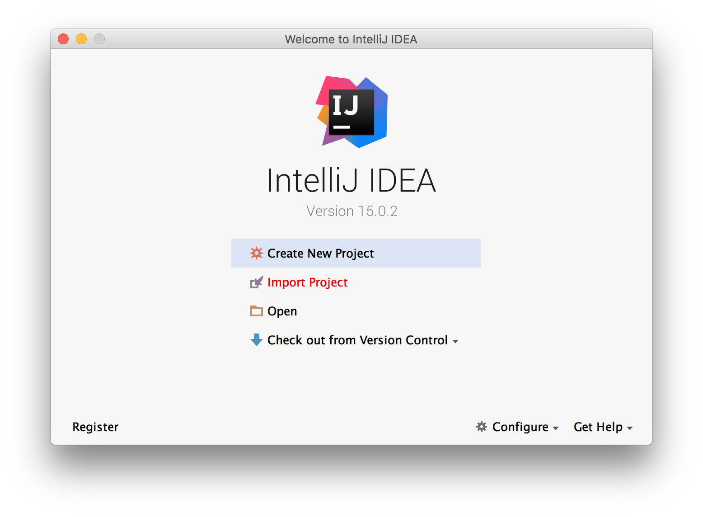
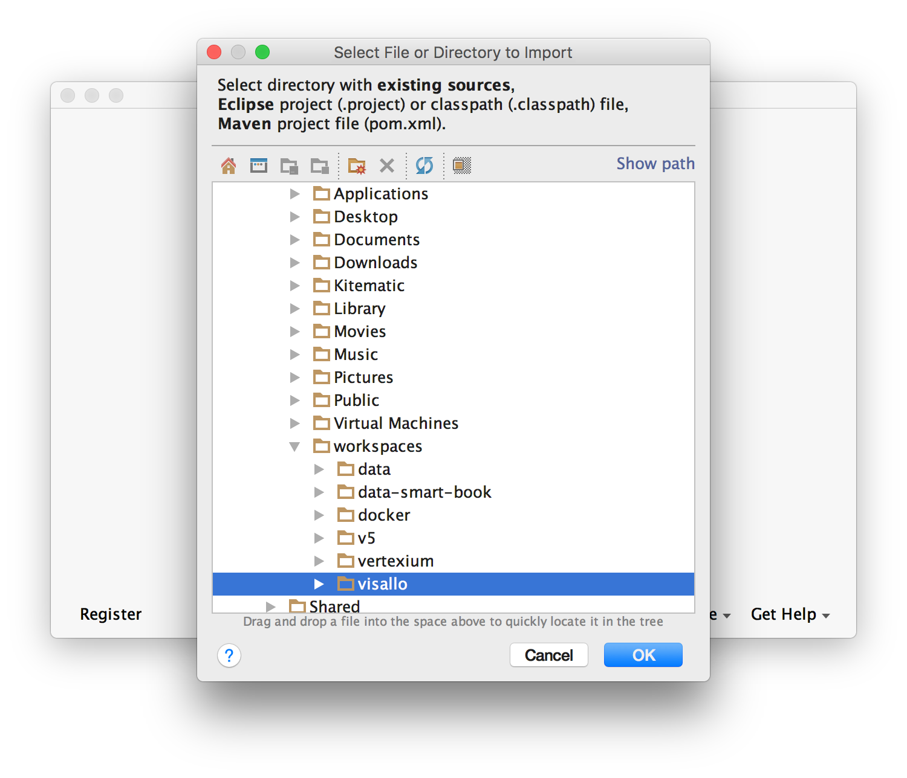
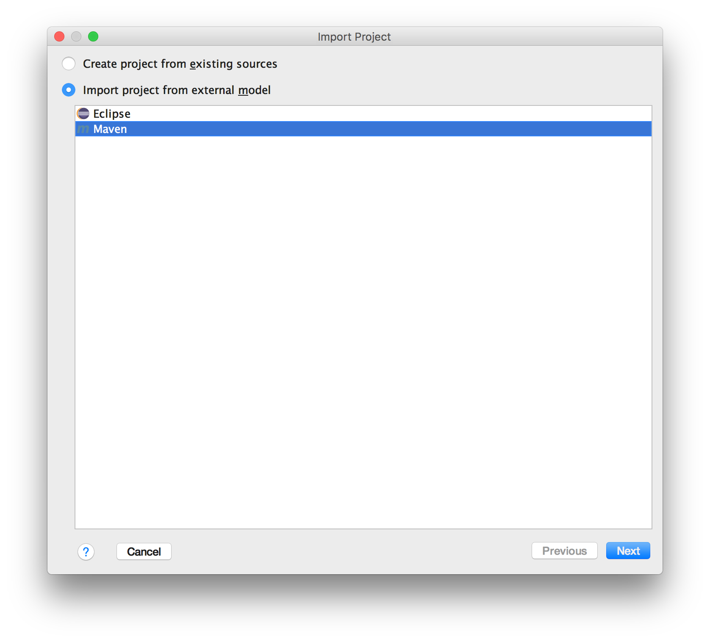
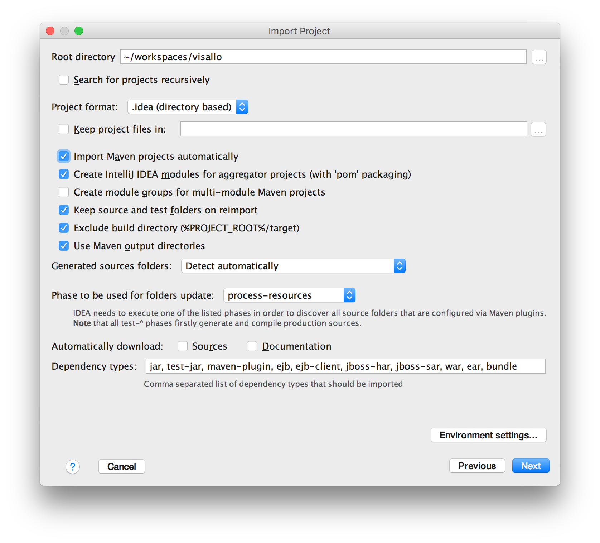
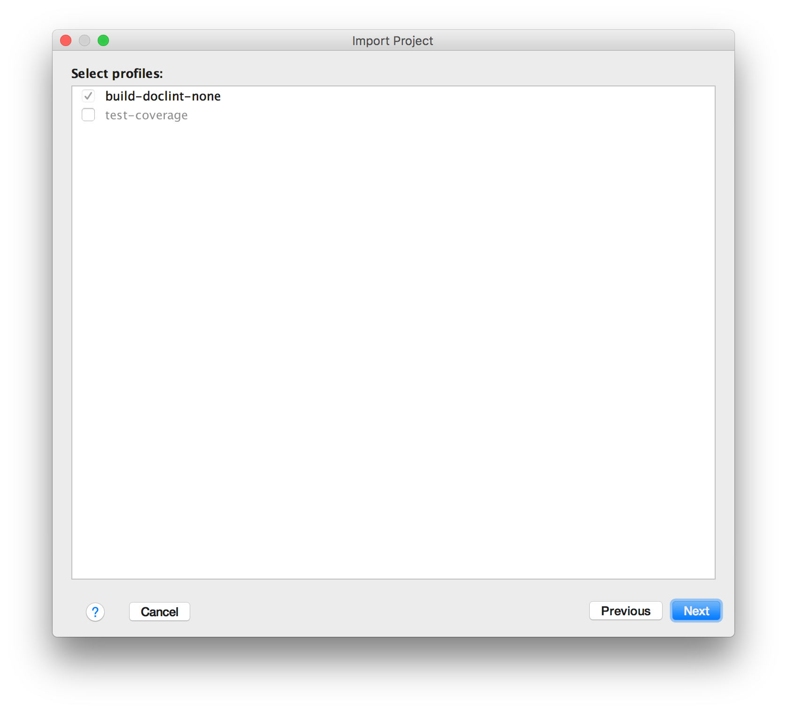
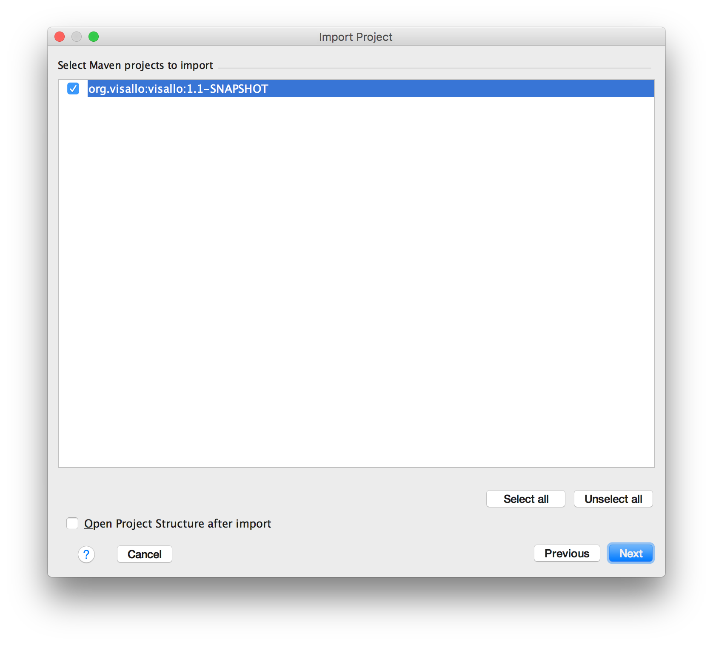
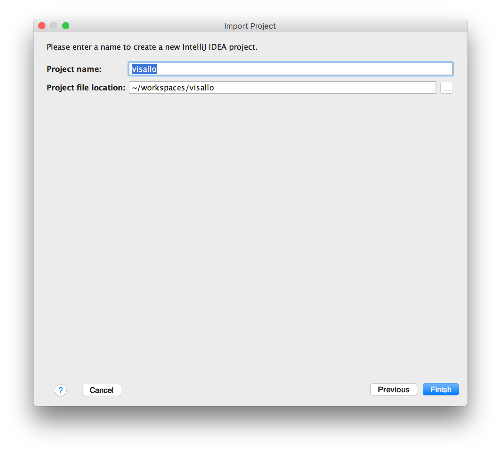

The instructions below will help you setup the [IntelliJ IDEA](https://www.jetbrains.com/idea/) IDE for Visallo development. These instructions should work with both the Community and Ultimate editions.

# Prerequisites

* Setup [configuration](configuration.md) on your host machine.
* Install [dependencies](../dependencies.md) on your host machine.
* Install the [root module](build.md#root-module) on your host machine.

# Import Project

Since you've most likely already cloned the Visallo code to your local machine, you'll need to import the project into IntelliJ. From the IntelliJ File menu or launch screen, select `Import Project` and follow the screenshots below to properly import the project.

Choose the Visallo project directory you've cloned and click the OK button.

Select "Import project from external model" and be sure to choose Maven. Click the Next button.

There are a lot of settings to choose from here. Just make your selections match the screenshot and click Next.

The "build-docline-none" profile should already be selected. Leave it as is and click the Next button.

There should only be one Maven project to import and it should already be selected. If not, choose visallo and click Next.

This screenshot shows the selection of JDK version 1.8. You may need to click the plus button near the top left to navigate the filesystem to your installation of JDK 1.8 if you've never done it before. Click the Next button once your screen looks similar.

The last step is to name the IntelliJ project. The default should be fine, but you can change it to something else if you really want.

## Run Configurations

Visallo ships with a collection of useful run configurations for IntelliJ. Unfortunately, importing the project into IntelliJ deletes them from their proper location. To get them back, run the following command from the project root directory.

        git checkout .idea/

The above command will re-checkout several files into the `$PROJECT_DIR/.idea/runConfigurations` directory. These files are the settings for each of the IntelliJ run configurations that ship with Visallo. They should automatically show up in the `Run -> Edit Configurations` dialog in IntelliJ.

## Maven Profile Selection

In the Maven Projects window of IntelliJ (right side) you'll find a dropdown titled `Profiles`. The base set of profiles that should be checked are listed below. Other profiles are used to enable and disable different features of Visallo during development.

* acl-ontology
* build-doclint-none
* build-webapp
* coordination-zookeeper
* gpw-core
* gpw-video (if you've installed ffmpeg dependency)
* queue-rabbitmq
* search-elasticsearch
* serializer-kryo
* storage-accumulo
* storage-hadoop
* web-admin
* web-auth-username-only
