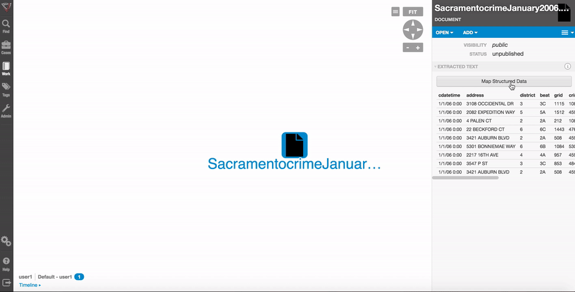
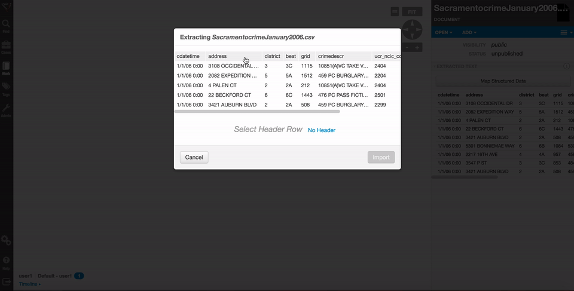
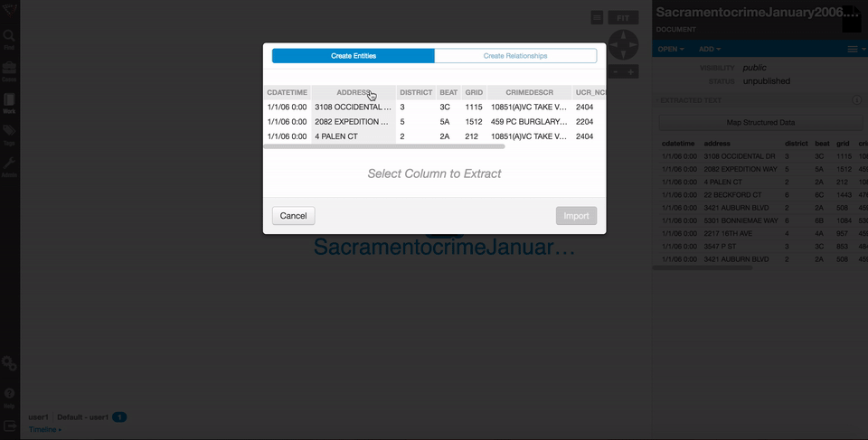
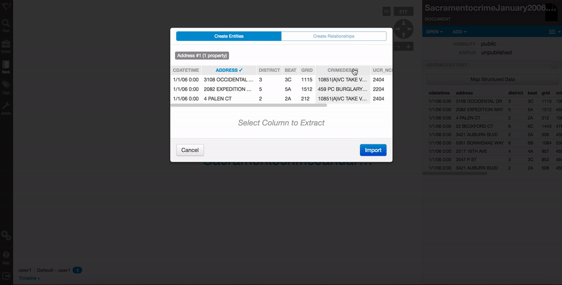
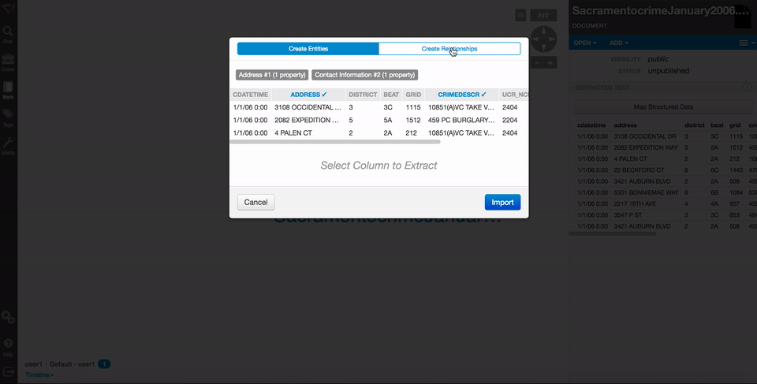
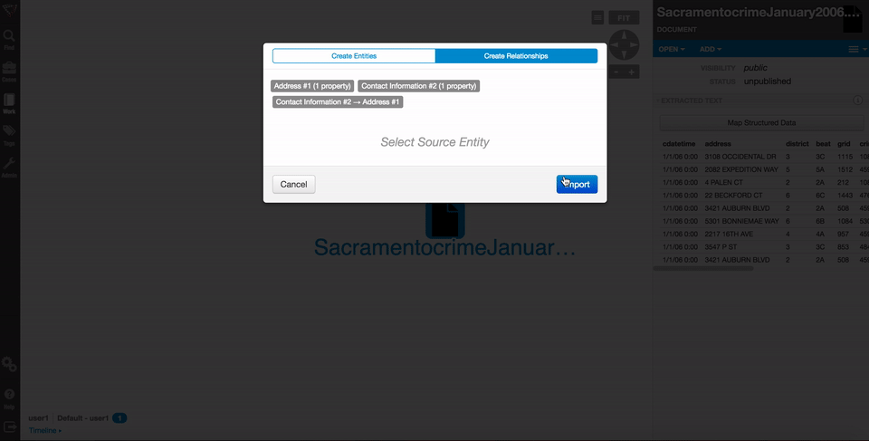

# CSV/Excel File Import

Visallo can import CSVs and extract entities from the data. There is a custom wizard available that will allow you to import whatever types of data that you need.  

## Steps to import data:

1. Drag the CSV or Excel file into Visallo.

2. Once the file shows a button that says "Map Structured Data" in the [detail panel](../detail-pane.md), click that button and the csv/excel import wizard will appear.

3. Decide which row is the first row.  If there is no header row, click the "No Header" link at the bottom.

4. Create the entity and add the properties by selecting columns and following the prompts.

5. You can add multiple different entity types.

6. Add relationships between the different entities by dragging arrows between the different entity types.

7. Lastly, add the entities into the system by clicking the Import button.

The data will be imported into your system with all of your configured entities and relationships.

### Possible problems
<a name='problems'>
 - It is not possible to import entities from a structured file that have already been published. An error will appear in the import wizard.
