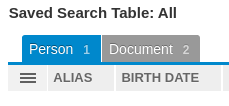

# Table

The Table dashboard card allows viewing searches in a column view table.

To add the Table view card to your dashboard, you will need a [saved search](../search.md). After
you have created a saved search begin by editing your dashboard and click add. Select "Saved Search Table"
then click "Configure Saved Search..." and select your search from the dropdown.

If multiple entity types exist in the results, multiple tabs will be displayed.

To customize the columns displayed and the order they are displayed in click the
. You can change the order by dragging the column names up and down.
